# Pandas로 국민청원 데이터 분석하기


```python
import pandas as pd
import numpy as np
import matplotlib as mpl
import matplotlib.pyplot as plt
import seaborn as sns 
```


```python
df = pd.read_csv('https://s3.ap-northeast-2.amazonaws.com/data10902/petition/petition.csv', parse_dates=['start', 'end'])
```


```python
df.shape #395547열, 9행
```


    (395547, 8)


```python
df.head(5) #앞 5행 미리보기
```


<div>
<style scoped>
    .dataframe tbody tr th:only-of-type {
        vertical-align: middle;
    }

    .dataframe tbody tr th {
        vertical-align: top;
    }

    .dataframe thead th {
        text-align: right;
    }
</style>
<table border="1" class="dataframe">
  <thead>
    <tr style="text-align: right;">
      <th></th>
      <th>article_id</th>
      <th>start</th>
      <th>end</th>
      <th>answered</th>
      <th>votes</th>
      <th>category</th>
      <th>title</th>
      <th>content</th>
    </tr>
  </thead>
  <tbody>
    <tr>
      <th>0</th>
      <td>21</td>
      <td>2017-08-19</td>
      <td>2017-11-17</td>
      <td>0</td>
      <td>9</td>
      <td>안전/환경</td>
      <td>스텔라 데이지호에 대한 제안입니다.</td>
      <td>스텔라 데이지호에 대한 제안입니다.\n3월31일 스텔라 데이지호가 침몰하고 5달째가...</td>
    </tr>
    <tr>
      <th>1</th>
      <td>22</td>
      <td>2017-08-19</td>
      <td>2017-11-17</td>
      <td>0</td>
      <td>17</td>
      <td>기타</td>
      <td>비리제보처를 만들어주세요.</td>
      <td>현 정부에 국민들이 가장 원하는 것은 부패척결입니다.  우리 사회에 각종 비리들이 ...</td>
    </tr>
    <tr>
      <th>2</th>
      <td>23</td>
      <td>2017-08-19</td>
      <td>2017-09-03</td>
      <td>0</td>
      <td>0</td>
      <td>미래</td>
      <td>제2의 개성공단</td>
      <td>만일 하시는 대통령님 및 각 부처 장관님,주무관님들 안녕하세요!!\n전남 목포에서 ...</td>
    </tr>
    <tr>
      <th>3</th>
      <td>24</td>
      <td>2017-08-19</td>
      <td>2017-08-26</td>
      <td>0</td>
      <td>53</td>
      <td>일자리</td>
      <td>공공기관 무조건적인 정규직전환을 반대합니다.</td>
      <td>현정부에서 정규직 일자리를 늘리는 것에 찬성합니다. 그런데 공공기관 비정규직들은 인...</td>
    </tr>
    <tr>
      <th>4</th>
      <td>25</td>
      <td>2017-08-19</td>
      <td>2017-09-03</td>
      <td>0</td>
      <td>0</td>
      <td>미래</td>
      <td>제2의 개성공단</td>
      <td>만일 하시는 대통령님 및 각 부처 장관님,주무관님들 안녕하세요!!\n전남 목포에서 ...</td>
    </tr>
  </tbody>
</table>
</div>


```python
df.isnull().sum() #content 열에 결측치 1 있음, 나머지 결측치 0
```


    article_id    0
    start         0
    end           0
    answered      0
    votes         0
    category      0
    title         0
    content       1
    dtype: int64


```python
df.info() #칼럼명과 타입 확인
```

    <class 'pandas.core.frame.DataFrame'>
    RangeIndex: 395547 entries, 0 to 395546
    Data columns (total 8 columns):
     #   Column      Non-Null Count   Dtype         
    ---  ------      --------------   -----         
     0   article_id  395547 non-null  int64         
     1   start       395547 non-null  datetime64[ns]
     2   end         395547 non-null  datetime64[ns]
     3   answered    395547 non-null  int64         
     4   votes       395547 non-null  int64         
     5   category    395547 non-null  object        
     6   title       395547 non-null  object        
     7   content     395546 non-null  object        
    dtypes: datetime64[ns](2), int64(3), object(3)
    memory usage: 24.1+ MB
    


```python
df.describe() #수치형 데이터 요약
```


<div>
<style scoped>
    .dataframe tbody tr th:only-of-type {
        vertical-align: middle;
    }

    .dataframe tbody tr th {
        vertical-align: top;
    }

    .dataframe thead th {
        text-align: right;
    }
</style>
<table border="1" class="dataframe">
  <thead>
    <tr style="text-align: right;">
      <th></th>
      <th>article_id</th>
      <th>answered</th>
      <th>votes</th>
    </tr>
  </thead>
  <tbody>
    <tr>
      <th>count</th>
      <td>395547.000000</td>
      <td>395547.000000</td>
      <td>3.955470e+05</td>
    </tr>
    <tr>
      <th>mean</th>
      <td>251608.934635</td>
      <td>0.000073</td>
      <td>1.501188e+02</td>
    </tr>
    <tr>
      <th>std</th>
      <td>153219.216242</td>
      <td>0.008562</td>
      <td>4.802583e+03</td>
    </tr>
    <tr>
      <th>min</th>
      <td>21.000000</td>
      <td>0.000000</td>
      <td>0.000000e+00</td>
    </tr>
    <tr>
      <th>25%</th>
      <td>115236.500000</td>
      <td>0.000000</td>
      <td>2.000000e+00</td>
    </tr>
    <tr>
      <th>50%</th>
      <td>253682.000000</td>
      <td>0.000000</td>
      <td>5.000000e+00</td>
    </tr>
    <tr>
      <th>75%</th>
      <td>386137.500000</td>
      <td>0.000000</td>
      <td>1.500000e+01</td>
    </tr>
    <tr>
      <th>max</th>
      <td>517122.000000</td>
      <td>1.000000</td>
      <td>1.192049e+06</td>
    </tr>
  </tbody>
</table>
</div>


```python
df.describe(include=np.object) #카테고리 형태의 데이터 요약
```


<div>
<style scoped>
    .dataframe tbody tr th:only-of-type {
        vertical-align: middle;
    }

    .dataframe tbody tr th {
        vertical-align: top;
    }

    .dataframe thead th {
        text-align: right;
    }
</style>
<table border="1" class="dataframe">
  <thead>
    <tr style="text-align: right;">
      <th></th>
      <th>category</th>
      <th>title</th>
      <th>content</th>
    </tr>
  </thead>
  <tbody>
    <tr>
      <th>count</th>
      <td>395547</td>
      <td>395547</td>
      <td>395546</td>
    </tr>
    <tr>
      <th>unique</th>
      <td>17</td>
      <td>346524</td>
      <td>375224</td>
    </tr>
    <tr>
      <th>top</th>
      <td>정치개혁</td>
      <td>이명박 출국금지</td>
      <td>이명박 출국금지</td>
    </tr>
    <tr>
      <th>freq</th>
      <td>62750</td>
      <td>3018</td>
      <td>597</td>
    </tr>
  </tbody>
</table>
</div>


### 1. 20만 이상 투표를 받은 '답변대상 청원' 분야별 순위


```python
df_20 = df.loc[df['votes'] > 200000] #20만건 이상 투표를 받은 '답변대상 청원' 보기
df_20.category.value_counts() #카테고리별 '답변대상 청원' 개수
```


    인권/성평등         24
    안전/환경          10
    정치개혁            8
    기타              8
    문화/예술/체육/언론     7
    외교/통일/국방        4
    반려동물            4
    보건복지            3
    육아/교육           3
    교통/건축/국토        3
    경제민주화           2
    성장동력            2
    미래              1
    행정              1
    Name: category, dtype: int64


```python
df_20_cat = df_20.category.value_counts()
df_20_category = df_20_cat.to_frame().reset_index()
df_20_category.columns = ['category','count']
df_20_category
```


<div>
<style scoped>
    .dataframe tbody tr th:only-of-type {
        vertical-align: middle;
    }

    .dataframe tbody tr th {
        vertical-align: top;
    }

    .dataframe thead th {
        text-align: right;
    }
</style>
<table border="1" class="dataframe">
  <thead>
    <tr style="text-align: right;">
      <th></th>
      <th>category</th>
      <th>count</th>
    </tr>
  </thead>
  <tbody>
    <tr>
      <th>0</th>
      <td>인권/성평등</td>
      <td>24</td>
    </tr>
    <tr>
      <th>1</th>
      <td>안전/환경</td>
      <td>10</td>
    </tr>
    <tr>
      <th>2</th>
      <td>정치개혁</td>
      <td>8</td>
    </tr>
    <tr>
      <th>3</th>
      <td>기타</td>
      <td>8</td>
    </tr>
    <tr>
      <th>4</th>
      <td>문화/예술/체육/언론</td>
      <td>7</td>
    </tr>
    <tr>
      <th>5</th>
      <td>외교/통일/국방</td>
      <td>4</td>
    </tr>
    <tr>
      <th>6</th>
      <td>반려동물</td>
      <td>4</td>
    </tr>
    <tr>
      <th>7</th>
      <td>보건복지</td>
      <td>3</td>
    </tr>
    <tr>
      <th>8</th>
      <td>육아/교육</td>
      <td>3</td>
    </tr>
    <tr>
      <th>9</th>
      <td>교통/건축/국토</td>
      <td>3</td>
    </tr>
    <tr>
      <th>10</th>
      <td>경제민주화</td>
      <td>2</td>
    </tr>
    <tr>
      <th>11</th>
      <td>성장동력</td>
      <td>2</td>
    </tr>
    <tr>
      <th>12</th>
      <td>미래</td>
      <td>1</td>
    </tr>
    <tr>
      <th>13</th>
      <td>행정</td>
      <td>1</td>
    </tr>
  </tbody>
</table>
</div>


```python
# matplotlib 한글 폰트 설정
plt.rc('font', family='NanumGothic') # For Windows
print(plt.rcParams['font.family'])
%matplotlib inline
```

    ['NanumGothic']
    


```python
ax = plt.subplots(figsize=(15, 9)) 
ax = sns.barplot(x='category', y='count', data=df_20_category)
ax.set_title('20만 이상 청원(답변대상 청원) 분야별 순위')
```


    Text(0.5, 1.0, '20만 이상 청원(답변대상 청원) 분야별 순위')


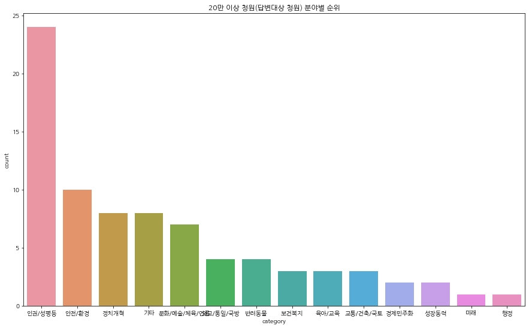


#### 1) 20만건 이상 투표를 받은 '답변대상 청원' 분야는 <인권/성평등>이 월등히 많았고, <안전/환경>이 2순위, <정치개혁>이 3순위로 그 뒤를 따른다.
#### 2) 반면 <행정>과 <미래> 분야의 청원은 가장 적은 수의 '답변대상 청원'을 보인다.

### 2. '답변대상 청원' 중 실제로 답변이 된 수 & 비율


```python
df['answer'] = (df['votes'] > 200000) == 1 #20만건 이상 투표를 받은 'answer' column
df['no_answer'] = (df['votes'] < 200000) == 1 #20만건 이상 투표를 받지 못한 'no_answer' column
```


```python
df.dtypes
```


    article_id             int64
    start         datetime64[ns]
    end           datetime64[ns]
    answered               int64
    votes                  int64
    category              object
    title                 object
    content               object
    answer                  bool
    no_answer               bool
    dtype: object


```python
df['answer'] = df['answer'].astype('int') #새로 생성해 준 answer의 타입은 boolean 타입이므로 -> int로 변경
df['no_answer'] = df['no_answer'].astype('int') #새로 생성해 준 no_answer의 타입은 boolean 타입이므로 -> int로 변경
```


```python
df['answer_diff'] = df['answer'] - df['answered']
df['answer_diff'].sum() #'답변대상 청원' 중 아직 답변되지 않은 청원의 수
```


    51


```python
is_answered = df['answered'] == 1
subset_df = df[is_answered]
subset_df
```


<div>
<style scoped>
    .dataframe tbody tr th:only-of-type {
        vertical-align: middle;
    }

    .dataframe tbody tr th {
        vertical-align: top;
    }

    .dataframe thead th {
        text-align: right;
    }
</style>
<table border="1" class="dataframe">
  <thead>
    <tr style="text-align: right;">
      <th></th>
      <th>article_id</th>
      <th>start</th>
      <th>end</th>
      <th>answered</th>
      <th>votes</th>
      <th>category</th>
      <th>title</th>
      <th>content</th>
      <th>answer</th>
      <th>no_answer</th>
      <th>answer_diff</th>
    </tr>
  </thead>
  <tbody>
    <tr>
      <th>1752</th>
      <td>1785</td>
      <td>2017-09-03</td>
      <td>2017-11-02</td>
      <td>1</td>
      <td>296330</td>
      <td>인권/성평등</td>
      <td>청소년이란 이유로 보호법을 악용하는 잔인무도한 청소년들이 늘어나고있습니다. 반드시 ...</td>
      <td>안녕하십니까. 청소년보호법이란 명목하에 나쁜짓을 일삼는 청소년들이 너무나 많아지고 ...</td>
      <td>1</td>
      <td>0</td>
      <td>0</td>
    </tr>
    <tr>
      <th>10894</th>
      <td>10949</td>
      <td>2017-09-06</td>
      <td>2017-12-05</td>
      <td>1</td>
      <td>615354</td>
      <td>미래</td>
      <td>조두순 출소반대</td>
      <td>제발 조두순 재심다시해서 무기징역으로 해야됩니다!!!</td>
      <td>1</td>
      <td>0</td>
      <td>0</td>
    </tr>
    <tr>
      <th>18111</th>
      <td>18278</td>
      <td>2017-09-30</td>
      <td>2017-10-30</td>
      <td>1</td>
      <td>235372</td>
      <td>인권/성평등</td>
      <td>낙태죄 폐지와 자연유산 유도약(미프진) 합법화 및 도입을 부탁드립니다.</td>
      <td>안녕하세요. 존경하는 대통령님 의원님\n낙태죄 폐지를 청원합니다.\n현재 대한민국은...</td>
      <td>1</td>
      <td>0</td>
      <td>0</td>
    </tr>
    <tr>
      <th>25032</th>
      <td>26024</td>
      <td>2017-11-04</td>
      <td>2017-12-04</td>
      <td>1</td>
      <td>216774</td>
      <td>안전/환경</td>
      <td>'주취감형(술을 먹으면 형벌 감형)' 폐지를 건의(청원)합니다.</td>
      <td>'주취감형'이란, 술을 먹고 범행을 저지를 때, 심신미약 (이성이 없고 우발적)이라...</td>
      <td>1</td>
      <td>0</td>
      <td>0</td>
    </tr>
    <tr>
      <th>43992</th>
      <td>45581</td>
      <td>2017-11-17</td>
      <td>2017-12-17</td>
      <td>1</td>
      <td>281985</td>
      <td>보건복지</td>
      <td>권역외상센터 (이국종 교수님) 추가적, 제도적, 환경적, 인력 지원</td>
      <td>청원사항)\n중증외상분야의 추가적, 제도적, 환경적, 인력 지원 방안마련\n현 의료...</td>
      <td>1</td>
      <td>0</td>
      <td>0</td>
    </tr>
    <tr>
      <th>47285</th>
      <td>49083</td>
      <td>2017-11-24</td>
      <td>2017-12-24</td>
      <td>1</td>
      <td>211064</td>
      <td>기타</td>
      <td>전안법. 18살, 미성년자에게 정부가 직접 찍어주는 범죄자 낙인!</td>
      <td>3년 이하의 징역, 또는3천만원 이하의 벌금. 혹은 500만원 이하의 과태료.\n설...</td>
      <td>1</td>
      <td>0</td>
      <td>0</td>
    </tr>
    <tr>
      <th>54896</th>
      <td>57132</td>
      <td>2017-12-03</td>
      <td>2018-01-02</td>
      <td>1</td>
      <td>255554</td>
      <td>성장동력</td>
      <td>전안법 합리적으로 개정 또는 폐지해주세요.(소상공인 소비자 모두 죽는법안입니다.)</td>
      <td>2017년 1월 28일부터 시행되는 법령으로 국가기술표준원에서 관리하는 전기제품에만...</td>
      <td>1</td>
      <td>0</td>
      <td>0</td>
    </tr>
    <tr>
      <th>70744</th>
      <td>76020</td>
      <td>2017-12-28</td>
      <td>2018-01-27</td>
      <td>1</td>
      <td>228295</td>
      <td>성장동력</td>
      <td>&lt;가상화폐규제반대&gt; 정부는 국민들에게 단 한번이라도 행복한 꿈을 꾸게 해본적 있습니까?</td>
      <td>저는 정부에게 묻고 싶습니다.\n정부는 단 한번이라도 우리 국민들에게 행복한 꿈을 ...</td>
      <td>1</td>
      <td>0</td>
      <td>0</td>
    </tr>
    <tr>
      <th>73197</th>
      <td>79162</td>
      <td>2018-01-03</td>
      <td>2018-02-02</td>
      <td>1</td>
      <td>233842</td>
      <td>인권/성평등</td>
      <td>미성년자 성폭행 형량 올려주세요 종신형원합니다</td>
      <td>또 창원에서 조두순사건과 같은 사건이 발생했네요\n술먹어 심신이 미약하신 50대 대...</td>
      <td>1</td>
      <td>0</td>
      <td>0</td>
    </tr>
    <tr>
      <th>74640</th>
      <td>81026</td>
      <td>2018-01-06</td>
      <td>2018-02-05</td>
      <td>1</td>
      <td>213219</td>
      <td>인권/성평등</td>
      <td>초.중.고 학교 페미니즘교육 의무화</td>
      <td>아직 판단이 무분별한 어린학생들이 학교에서 여성비하적요소가 들어있는 단어들을 아무렇...</td>
      <td>1</td>
      <td>0</td>
      <td>0</td>
    </tr>
    <tr>
      <th>84324</th>
      <td>95138</td>
      <td>2018-01-14</td>
      <td>2018-02-13</td>
      <td>1</td>
      <td>219395</td>
      <td>교통/건축/국토</td>
      <td>대전 아파트 단지내 횡단보도 교통사고..가해자의 만행과 도로교통법의 허점</td>
      <td>1. 2017년 10월 16일 19시10분경 대전 맑은 아침 아파트 단지 내 횡단보...</td>
      <td>1</td>
      <td>0</td>
      <td>0</td>
    </tr>
    <tr>
      <th>85497</th>
      <td>96427</td>
      <td>2018-01-15</td>
      <td>2018-02-14</td>
      <td>1</td>
      <td>277674</td>
      <td>정치개혁</td>
      <td>국회의원 급여를 최저시급으로 책정해 주세요</td>
      <td>최저시급 인상 반대하던 의원들부터 최저시급으로 책정해주시고 최저시급으로 일하는 노동...</td>
      <td>1</td>
      <td>0</td>
      <td>0</td>
    </tr>
    <tr>
      <th>89188</th>
      <td>101349</td>
      <td>2018-01-18</td>
      <td>2018-02-17</td>
      <td>1</td>
      <td>212992</td>
      <td>문화/예술/체육/언론</td>
      <td>포털사이트 ‘네이버’에 대한 철저한 수사가 필요합니다.</td>
      <td>현재 대한민국에서 언론에 대한 불신이 너무 팽배합니다.\n국민들은 속칭 기레기라고 ...</td>
      <td>1</td>
      <td>0</td>
      <td>0</td>
    </tr>
    <tr>
      <th>91882</th>
      <td>105105</td>
      <td>2018-01-20</td>
      <td>2018-02-19</td>
      <td>1</td>
      <td>360905</td>
      <td>외교/통일/국방</td>
      <td>나경원 의원 평창올림픽 위원직을 파면시켜주세요</td>
      <td>안녕하세요. 청와대에 청원은 처음해 보는 경험인지라 조금은 어색하고 뭐라 말을 시작...</td>
      <td>1</td>
      <td>0</td>
      <td>0</td>
    </tr>
    <tr>
      <th>98134</th>
      <td>113699</td>
      <td>2018-01-25</td>
      <td>2018-02-24</td>
      <td>1</td>
      <td>235167</td>
      <td>안전/환경</td>
      <td>일간베스트 저장소(일베) 사이트 폐쇄를 요청합니다</td>
      <td>거론된 사이트는 정치적이거나 사회적으로 이슈된 모든 현안들에 대해 허위날조된 정보를...</td>
      <td>1</td>
      <td>0</td>
      <td>0</td>
    </tr>
    <tr>
      <th>106657</th>
      <td>127921</td>
      <td>2018-02-05</td>
      <td>2018-03-07</td>
      <td>1</td>
      <td>252969</td>
      <td>보건복지</td>
      <td>정형식 판사에 대해서 이 판결과 그 동안 판결에 대한 특별 감사를 청원합니다!!!</td>
      <td>국민의 돈인 국민 연금에 손실을 입힌 범죄자의 구속을 임의로 풀어준\n정형식 판사에...</td>
      <td>1</td>
      <td>0</td>
      <td>0</td>
    </tr>
    <tr>
      <th>112158</th>
      <td>134590</td>
      <td>2018-02-08</td>
      <td>2018-03-10</td>
      <td>1</td>
      <td>207772</td>
      <td>경제민주화</td>
      <td>경제민주화</td>
      <td>김상조 공정거래위원장이 경제정의 구현을 위한  정책들에 대해서 적극적인 지지를 보냅...</td>
      <td>1</td>
      <td>0</td>
      <td>0</td>
    </tr>
    <tr>
      <th>117927</th>
      <td>141333</td>
      <td>2018-02-17</td>
      <td>2018-03-19</td>
      <td>1</td>
      <td>208522</td>
      <td>문화/예술/체육/언론</td>
      <td>연극인 이윤택씨의 상습 성폭행, 성폭력 피의사실에 대한 철저한 진상규명과 조사를 촉...</td>
      <td>&lt; 연극인 이윤택씨의 상습 성폭행 및 성폭력 피의사실 의혹에 대해 다음과 같은 청원...</td>
      <td>1</td>
      <td>0</td>
      <td>0</td>
    </tr>
    <tr>
      <th>118970</th>
      <td>142600</td>
      <td>2018-02-19</td>
      <td>2018-03-21</td>
      <td>1</td>
      <td>614127</td>
      <td>문화/예술/체육/언론</td>
      <td>김보름, 박지우 선수의 자격박탈과 적폐 빙상연맹의 엄중 처벌을 청원합니다</td>
      <td>오늘 여자 단체전 팀추월에서 김보름, 박지우 선수는 팀전인데도 불구하고 개인의 영달...</td>
      <td>1</td>
      <td>0</td>
      <td>0</td>
    </tr>
    <tr>
      <th>124216</th>
      <td>148613</td>
      <td>2018-02-23</td>
      <td>2018-03-25</td>
      <td>1</td>
      <td>217054</td>
      <td>육아/교육</td>
      <td>미혼모를 위한 히트 앤드 런 방지법을 만들어주세요. #GIRLS_CAN_DO_ANY...</td>
      <td>#GIRLS_CAN_DO_ANYTHING\n1. 현황 및 문제점\n2005년부터 생...</td>
      <td>1</td>
      <td>0</td>
      <td>0</td>
    </tr>
    <tr>
      <th>124397</th>
      <td>148806</td>
      <td>2018-02-23</td>
      <td>2018-03-25</td>
      <td>1</td>
      <td>242687</td>
      <td>인권/성평등</td>
      <td>조두순 사건의 피해자 가족을 우롱하는 윤서인을 처벌해주십시오</td>
      <td>'윤서인'이라는 만화가가 조두순 사건을 인용하여 정치상황을 풍자하는 만화를 그렸는데...</td>
      <td>1</td>
      <td>0</td>
      <td>0</td>
    </tr>
    <tr>
      <th>126532</th>
      <td>151430</td>
      <td>2018-02-26</td>
      <td>2018-03-28</td>
      <td>1</td>
      <td>235796</td>
      <td>인권/성평등</td>
      <td>고 장자연의 한맺힌 죽음의 진실을 밝혀주세요.</td>
      <td>힘없고 빽없는  사람이\n사회적 영향력 금권 기득권으로\n꽃다운 나이에\n한 많은 ...</td>
      <td>1</td>
      <td>0</td>
      <td>0</td>
    </tr>
    <tr>
      <th>131327</th>
      <td>157046</td>
      <td>2018-03-03</td>
      <td>2018-04-02</td>
      <td>1</td>
      <td>222770</td>
      <td>인권/성평등</td>
      <td>단역배우 자매 자살 사건 제발 재조사를 해주세여.</td>
      <td>http://news.naver.com/main/read.nhn?mode=LSD&amp;m...</td>
      <td>1</td>
      <td>0</td>
      <td>0</td>
    </tr>
    <tr>
      <th>164274</th>
      <td>203181</td>
      <td>2018-04-17</td>
      <td>2018-05-17</td>
      <td>1</td>
      <td>302082</td>
      <td>행정</td>
      <td>다산신도시 실버택배 비용은 입주민들의 관리비로 충당해야합니다.</td>
      <td>다산신도시 입주민들이 택배원 대상으로 갑질을 저질러 사회적으로 큰 물의를 빚은 바 ...</td>
      <td>1</td>
      <td>0</td>
      <td>0</td>
    </tr>
    <tr>
      <th>183791</th>
      <td>230552</td>
      <td>2018-05-11</td>
      <td>2018-06-10</td>
      <td>1</td>
      <td>419006</td>
      <td>인권/성평등</td>
      <td>여성도 대한민국 국민입니다. 성별 관계없는 국가의 보호를 요청합니다.</td>
      <td>최근 홍대 누드크로키 모델의 불법촬영 사건이 있었습니다.\n사건은 굉장히 빠르게 처...</td>
      <td>1</td>
      <td>0</td>
      <td>0</td>
    </tr>
    <tr>
      <th>186976</th>
      <td>235102</td>
      <td>2018-05-17</td>
      <td>2018-06-16</td>
      <td>1</td>
      <td>201590</td>
      <td>인권/성평등</td>
      <td>합정 **** 불법 누드촬영</td>
      <td>한 유명 유튜버의 사례\n저는 성범죄 피해자입니다. 꼭 한번만 제 이야기를 들어주세...</td>
      <td>1</td>
      <td>0</td>
      <td>0</td>
    </tr>
    <tr>
      <th>209715</th>
      <td>270921</td>
      <td>2018-06-14</td>
      <td>2018-07-14</td>
      <td>1</td>
      <td>219987</td>
      <td>문화/예술/체육/언론</td>
      <td>대구 동성로/서울 시청광장   퀴어행사(동성애축제)개최를 반대합니다.</td>
      <td>서울 시청/대구 동성로  퀴어행사(동성애축제)개최를 반대합니다.\n대구 6월 23일...</td>
      <td>1</td>
      <td>0</td>
      <td>0</td>
    </tr>
    <tr>
      <th>303793</th>
      <td>395955</td>
      <td>2018-10-02</td>
      <td>2018-11-01</td>
      <td>1</td>
      <td>406655</td>
      <td>교통/건축/국토</td>
      <td>음주운전 교통사고로 친구 인생이 박살났습니다. 제발 도와주세요</td>
      <td>9월 25일 새벽 2시 25분 경, 부산 해운대구 미포 오거리에서 술에 만취한 운전...</td>
      <td>1</td>
      <td>0</td>
      <td>0</td>
    </tr>
    <tr>
      <th>305013</th>
      <td>397558</td>
      <td>2018-10-04</td>
      <td>2018-11-03</td>
      <td>1</td>
      <td>275806</td>
      <td>정치개혁</td>
      <td>최**과 이하 비슷한 리벤지포르노 범들 강력징역해주세요.</td>
      <td>리벤지포르노 징역이라고 네이버에 치면\n제일 먼저 뜨는 기사가 뭔줄 아십니까?\n“...</td>
      <td>1</td>
      <td>0</td>
      <td>0</td>
    </tr>
  </tbody>
</table>
</div>


```python
subset_df_category = subset_df.category.value_counts()
subset_df_count = subset_df_category.to_frame().reset_index()
subset_df_count.columns = ['category','yes']
subset_df_count
```


<div>
<style scoped>
    .dataframe tbody tr th:only-of-type {
        vertical-align: middle;
    }

    .dataframe tbody tr th {
        vertical-align: top;
    }

    .dataframe thead th {
        text-align: right;
    }
</style>
<table border="1" class="dataframe">
  <thead>
    <tr style="text-align: right;">
      <th></th>
      <th>category</th>
      <th>yes</th>
    </tr>
  </thead>
  <tbody>
    <tr>
      <th>0</th>
      <td>인권/성평등</td>
      <td>9</td>
    </tr>
    <tr>
      <th>1</th>
      <td>문화/예술/체육/언론</td>
      <td>4</td>
    </tr>
    <tr>
      <th>2</th>
      <td>보건복지</td>
      <td>2</td>
    </tr>
    <tr>
      <th>3</th>
      <td>정치개혁</td>
      <td>2</td>
    </tr>
    <tr>
      <th>4</th>
      <td>안전/환경</td>
      <td>2</td>
    </tr>
    <tr>
      <th>5</th>
      <td>성장동력</td>
      <td>2</td>
    </tr>
    <tr>
      <th>6</th>
      <td>교통/건축/국토</td>
      <td>2</td>
    </tr>
    <tr>
      <th>7</th>
      <td>미래</td>
      <td>1</td>
    </tr>
    <tr>
      <th>8</th>
      <td>외교/통일/국방</td>
      <td>1</td>
    </tr>
    <tr>
      <th>9</th>
      <td>기타</td>
      <td>1</td>
    </tr>
    <tr>
      <th>10</th>
      <td>육아/교육</td>
      <td>1</td>
    </tr>
    <tr>
      <th>11</th>
      <td>경제민주화</td>
      <td>1</td>
    </tr>
    <tr>
      <th>12</th>
      <td>행정</td>
      <td>1</td>
    </tr>
  </tbody>
</table>
</div>


```python
result = pd.merge(subset_df_count, df_20_category,on='category')
result['no'] = result['count'] - result['yes']
result1 = result[['category', 'yes', 'no']]
result1
```


<div>
<style scoped>
    .dataframe tbody tr th:only-of-type {
        vertical-align: middle;
    }

    .dataframe tbody tr th {
        vertical-align: top;
    }

    .dataframe thead th {
        text-align: right;
    }
</style>
<table border="1" class="dataframe">
  <thead>
    <tr style="text-align: right;">
      <th></th>
      <th>category</th>
      <th>yes</th>
      <th>no</th>
    </tr>
  </thead>
  <tbody>
    <tr>
      <th>0</th>
      <td>인권/성평등</td>
      <td>9</td>
      <td>15</td>
    </tr>
    <tr>
      <th>1</th>
      <td>문화/예술/체육/언론</td>
      <td>4</td>
      <td>3</td>
    </tr>
    <tr>
      <th>2</th>
      <td>보건복지</td>
      <td>2</td>
      <td>1</td>
    </tr>
    <tr>
      <th>3</th>
      <td>정치개혁</td>
      <td>2</td>
      <td>6</td>
    </tr>
    <tr>
      <th>4</th>
      <td>안전/환경</td>
      <td>2</td>
      <td>8</td>
    </tr>
    <tr>
      <th>5</th>
      <td>성장동력</td>
      <td>2</td>
      <td>0</td>
    </tr>
    <tr>
      <th>6</th>
      <td>교통/건축/국토</td>
      <td>2</td>
      <td>1</td>
    </tr>
    <tr>
      <th>7</th>
      <td>미래</td>
      <td>1</td>
      <td>0</td>
    </tr>
    <tr>
      <th>8</th>
      <td>외교/통일/국방</td>
      <td>1</td>
      <td>3</td>
    </tr>
    <tr>
      <th>9</th>
      <td>기타</td>
      <td>1</td>
      <td>7</td>
    </tr>
    <tr>
      <th>10</th>
      <td>육아/교육</td>
      <td>1</td>
      <td>2</td>
    </tr>
    <tr>
      <th>11</th>
      <td>경제민주화</td>
      <td>1</td>
      <td>1</td>
    </tr>
    <tr>
      <th>12</th>
      <td>행정</td>
      <td>1</td>
      <td>0</td>
    </tr>
  </tbody>
</table>
</div>


```python
ax = result1.plot.bar(x='category',stacked=True)
ax.set_ylabel('answered yes or no')
ax.set_title('답변대상 청원 중 실제로 답변 받은 수 순위')
```


    Text(0.5, 1.0, '답변대상 청원 중 실제로 답변 받은 수 순위')


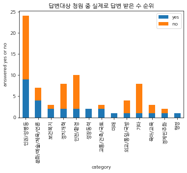


#### 1) 20만건 이상 투표를 받은 '답변대상 청원' 중 실제로 답변을 받은 수는 <인권/성평등>이 가장 많다. <인권/성평등> 분야의 청원이 월등히 많았던 만큼, 답변 받은 수도 많다.

#### 2) <행정>과 <미래> 분야의 청원은 가장 적은 수의 '답변대상 청원'이었지만, 모두 답변되었다.


```python
result['ratio'] = result['yes'] / (result['count'])
result2 = result[['category', 'ratio']]
result2
```


<div>
<style scoped>
    .dataframe tbody tr th:only-of-type {
        vertical-align: middle;
    }

    .dataframe tbody tr th {
        vertical-align: top;
    }

    .dataframe thead th {
        text-align: right;
    }
</style>
<table border="1" class="dataframe">
  <thead>
    <tr style="text-align: right;">
      <th></th>
      <th>category</th>
      <th>ratio</th>
    </tr>
  </thead>
  <tbody>
    <tr>
      <th>0</th>
      <td>인권/성평등</td>
      <td>0.375000</td>
    </tr>
    <tr>
      <th>1</th>
      <td>문화/예술/체육/언론</td>
      <td>0.571429</td>
    </tr>
    <tr>
      <th>2</th>
      <td>보건복지</td>
      <td>0.666667</td>
    </tr>
    <tr>
      <th>3</th>
      <td>정치개혁</td>
      <td>0.250000</td>
    </tr>
    <tr>
      <th>4</th>
      <td>안전/환경</td>
      <td>0.200000</td>
    </tr>
    <tr>
      <th>5</th>
      <td>성장동력</td>
      <td>1.000000</td>
    </tr>
    <tr>
      <th>6</th>
      <td>교통/건축/국토</td>
      <td>0.666667</td>
    </tr>
    <tr>
      <th>7</th>
      <td>미래</td>
      <td>1.000000</td>
    </tr>
    <tr>
      <th>8</th>
      <td>외교/통일/국방</td>
      <td>0.250000</td>
    </tr>
    <tr>
      <th>9</th>
      <td>기타</td>
      <td>0.125000</td>
    </tr>
    <tr>
      <th>10</th>
      <td>육아/교육</td>
      <td>0.333333</td>
    </tr>
    <tr>
      <th>11</th>
      <td>경제민주화</td>
      <td>0.500000</td>
    </tr>
    <tr>
      <th>12</th>
      <td>행정</td>
      <td>1.000000</td>
    </tr>
  </tbody>
</table>
</div>


```python
ax = plt.subplots(figsize=(15, 9)) 
ax = sns.barplot(x='category',y='ratio', data=result2)
ax.set_ylabel('answered ratio')
ax.set_title('답변대상 청원 중 실제로 답변 받은 수 비율')
```


    Text(0.5, 1.0, '답변대상 청원 중 실제로 답변 받은 수 비율')


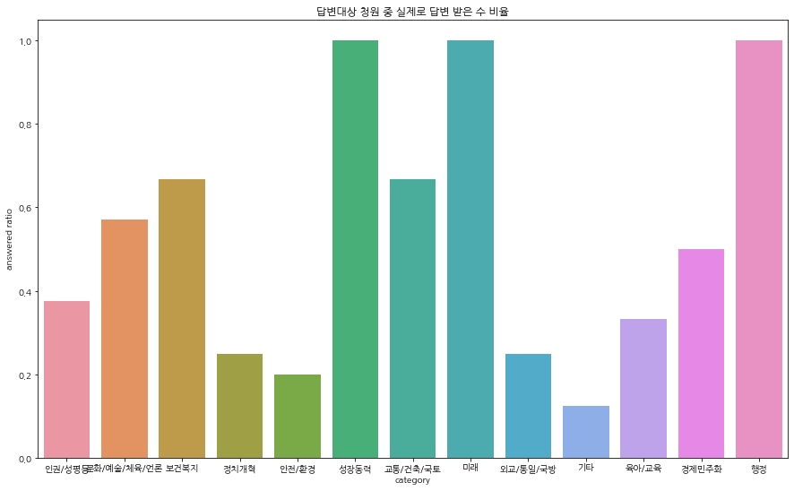


#### 1) 20만건 이상 투표를 받은 '답변대상 청원' 중 실제로 답변을 받은 '비율'을 살펴보면 <성장동력>과 <미래>, <행정> 분야에서는 모두 답변되었기에 가장 높은 답변 비율을 보인다.

#### 2) 오히려 <인권/성평등>의 답변 비율은 0.5를 넘지 않는 것을 알 수 있다. 
#### <인권/성평등> 분야의 답변대상 청원 요구는 가장 많았지만 답변 비율은 하위에 속하는 만큼, 이에 대한 대응이 필요하다 볼 수 있겠다.


### 3. '답변대상 청원' 중 투표는 어느 분야가 가장 많이 받았는가?


```python
answered_df = df.loc[df['answer'] == 1]
answered_df.sort_values('votes', ascending=False).head(5) #답변 대상 청원 중 투표를 가장 많이 받은 것; 강서구 피시방 살인사건
```


<div>
<style scoped>
    .dataframe tbody tr th:only-of-type {
        vertical-align: middle;
    }

    .dataframe tbody tr th {
        vertical-align: top;
    }

    .dataframe thead th {
        text-align: right;
    }
</style>
<table border="1" class="dataframe">
  <thead>
    <tr style="text-align: right;">
      <th></th>
      <th>article_id</th>
      <th>start</th>
      <th>end</th>
      <th>answered</th>
      <th>votes</th>
      <th>category</th>
      <th>title</th>
      <th>content</th>
      <th>answer</th>
      <th>no_answer</th>
      <th>answer_diff</th>
    </tr>
  </thead>
  <tbody>
    <tr>
      <th>313314</th>
      <td>408609</td>
      <td>2018-10-17</td>
      <td>2018-11-16</td>
      <td>0</td>
      <td>1192049</td>
      <td>안전/환경</td>
      <td>강서구 피시방 살인 사건. 또 심신미약 피의자입니다.</td>
      <td>2018년 10월 14일 엊그제 일어난 강서구 피시방 살인사건에 대한 청원입니다.\...</td>
      <td>1</td>
      <td>0</td>
      <td>1</td>
    </tr>
    <tr>
      <th>208597</th>
      <td>269548</td>
      <td>2018-06-13</td>
      <td>2018-07-13</td>
      <td>0</td>
      <td>714875</td>
      <td>외교/통일/국방</td>
      <td>제주도 불법 난민 신청 문제에 따른 난민법, 무사증 입국, 난민신청허가 폐지/개헌 ...</td>
      <td>2012년 난민법 제정으로 인해 외국인은 한달 무비자로 입국할 수 있으나 난민신청자...</td>
      <td>1</td>
      <td>0</td>
      <td>1</td>
    </tr>
    <tr>
      <th>10894</th>
      <td>10949</td>
      <td>2017-09-06</td>
      <td>2017-12-05</td>
      <td>1</td>
      <td>615354</td>
      <td>미래</td>
      <td>조두순 출소반대</td>
      <td>제발 조두순 재심다시해서 무기징역으로 해야됩니다!!!</td>
      <td>1</td>
      <td>0</td>
      <td>0</td>
    </tr>
    <tr>
      <th>118970</th>
      <td>142600</td>
      <td>2018-02-19</td>
      <td>2018-03-21</td>
      <td>1</td>
      <td>614127</td>
      <td>문화/예술/체육/언론</td>
      <td>김보름, 박지우 선수의 자격박탈과 적폐 빙상연맹의 엄중 처벌을 청원합니다</td>
      <td>오늘 여자 단체전 팀추월에서 김보름, 박지우 선수는 팀전인데도 불구하고 개인의 영달...</td>
      <td>1</td>
      <td>0</td>
      <td>0</td>
    </tr>
    <tr>
      <th>183791</th>
      <td>230552</td>
      <td>2018-05-11</td>
      <td>2018-06-10</td>
      <td>1</td>
      <td>419006</td>
      <td>인권/성평등</td>
      <td>여성도 대한민국 국민입니다. 성별 관계없는 국가의 보호를 요청합니다.</td>
      <td>최근 홍대 누드크로키 모델의 불법촬영 사건이 있었습니다.\n사건은 굉장히 빠르게 처...</td>
      <td>1</td>
      <td>0</td>
      <td>0</td>
    </tr>
  </tbody>
</table>
</div>


```python
k = answered_df.groupby(answered_df['category']).sum('votes')
kk = k.sort_values('votes', ascending=False).reset_index()
kkk = kk[['category','votes']]
kkk
```


<div>
<style scoped>
    .dataframe tbody tr th:only-of-type {
        vertical-align: middle;
    }

    .dataframe tbody tr th {
        vertical-align: top;
    }

    .dataframe thead th {
        text-align: right;
    }
</style>
<table border="1" class="dataframe">
  <thead>
    <tr style="text-align: right;">
      <th></th>
      <th>category</th>
      <th>votes</th>
    </tr>
  </thead>
  <tbody>
    <tr>
      <th>0</th>
      <td>인권/성평등</td>
      <td>6345077</td>
    </tr>
    <tr>
      <th>1</th>
      <td>안전/환경</td>
      <td>3206169</td>
    </tr>
    <tr>
      <th>2</th>
      <td>정치개혁</td>
      <td>2147763</td>
    </tr>
    <tr>
      <th>3</th>
      <td>기타</td>
      <td>2104193</td>
    </tr>
    <tr>
      <th>4</th>
      <td>문화/예술/체육/언론</td>
      <td>1937133</td>
    </tr>
    <tr>
      <th>5</th>
      <td>외교/통일/국방</td>
      <td>1585690</td>
    </tr>
    <tr>
      <th>6</th>
      <td>반려동물</td>
      <td>867561</td>
    </tr>
    <tr>
      <th>7</th>
      <td>육아/교육</td>
      <td>852295</td>
    </tr>
    <tr>
      <th>8</th>
      <td>교통/건축/국토</td>
      <td>842498</td>
    </tr>
    <tr>
      <th>9</th>
      <td>보건복지</td>
      <td>749906</td>
    </tr>
    <tr>
      <th>10</th>
      <td>미래</td>
      <td>615354</td>
    </tr>
    <tr>
      <th>11</th>
      <td>성장동력</td>
      <td>483849</td>
    </tr>
    <tr>
      <th>12</th>
      <td>경제민주화</td>
      <td>450058</td>
    </tr>
    <tr>
      <th>13</th>
      <td>행정</td>
      <td>302082</td>
    </tr>
  </tbody>
</table>
</div>


```python
ax = plt.subplots(figsize=(15, 9)) 
ax = sns.barplot(x='category',y='votes', data=kkk)
ax.set_ylabel('total votes of answer')
ax.set_title('답변대상 청원 중 가장 많은 투표를 받은 분야는?')
```


    Text(0.5, 1.0, '답변대상 청원 중 가장 많은 투표를 받은 분야는?')


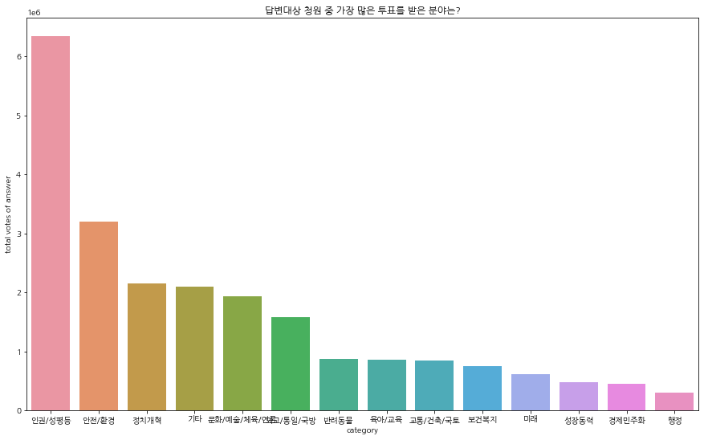


#### 1) '답변대상 청원' 중 <인권/성평등> 분야의 투표 총합이 가장 높다. 이어서 답변 대상 청원 중 투표를 가장 많이 받은; 강서구 피시방 살인사건이 속한 <안전/환경> 분야가 '답변대상 청원' 중 두 번째로 투표 수가 많다.

#### 2) '답변대상 청원' 수가 가장 적었던 <행정> 분야에서, '답변대상 청원' 투표 총합도 가장 낮다.


### 4. 어느 분야에서 청원이 가장 많이 들어왔는가?


```python
category = pd.DataFrame(df['category'].value_counts()).reset_index()
category.columns = ['category', 'counts']
category #어느 분야의 청원이 가장 많이 들어왔는지; 정치개혁
```


<div>
<style scoped>
    .dataframe tbody tr th:only-of-type {
        vertical-align: middle;
    }

    .dataframe tbody tr th {
        vertical-align: top;
    }

    .dataframe thead th {
        text-align: right;
    }
</style>
<table border="1" class="dataframe">
  <thead>
    <tr style="text-align: right;">
      <th></th>
      <th>category</th>
      <th>counts</th>
    </tr>
  </thead>
  <tbody>
    <tr>
      <th>0</th>
      <td>정치개혁</td>
      <td>62750</td>
    </tr>
    <tr>
      <th>1</th>
      <td>기타</td>
      <td>48682</td>
    </tr>
    <tr>
      <th>2</th>
      <td>인권/성평등</td>
      <td>34993</td>
    </tr>
    <tr>
      <th>3</th>
      <td>안전/환경</td>
      <td>30638</td>
    </tr>
    <tr>
      <th>4</th>
      <td>교통/건축/국토</td>
      <td>28184</td>
    </tr>
    <tr>
      <th>5</th>
      <td>외교/통일/국방</td>
      <td>26626</td>
    </tr>
    <tr>
      <th>6</th>
      <td>육아/교육</td>
      <td>25537</td>
    </tr>
    <tr>
      <th>7</th>
      <td>보건복지</td>
      <td>24848</td>
    </tr>
    <tr>
      <th>8</th>
      <td>일자리</td>
      <td>23225</td>
    </tr>
    <tr>
      <th>9</th>
      <td>행정</td>
      <td>20268</td>
    </tr>
    <tr>
      <th>10</th>
      <td>문화/예술/체육/언론</td>
      <td>18207</td>
    </tr>
    <tr>
      <th>11</th>
      <td>미래</td>
      <td>18000</td>
    </tr>
    <tr>
      <th>12</th>
      <td>경제민주화</td>
      <td>16793</td>
    </tr>
    <tr>
      <th>13</th>
      <td>성장동력</td>
      <td>7253</td>
    </tr>
    <tr>
      <th>14</th>
      <td>반려동물</td>
      <td>4057</td>
    </tr>
    <tr>
      <th>15</th>
      <td>저출산/고령화대책</td>
      <td>3584</td>
    </tr>
    <tr>
      <th>16</th>
      <td>농산어촌</td>
      <td>1902</td>
    </tr>
  </tbody>
</table>
</div>


```python
ax = plt.subplots(figsize=(15, 9)) 
ax = sns.barplot(x='category',y='counts', data=category)
ax.set_ylabel('total petitions')
ax.set_title('가장 많은 청원을 받은 분야는?')
```


    Text(0.5, 1.0, '가장 많은 청원을 받은 분야는?')


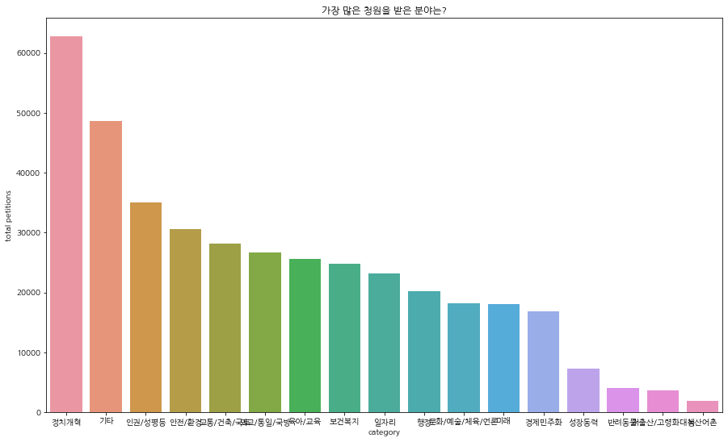


#### 1) 가장 많은 청원을 받은 분야는 <정치개혁> 분야이다. 이를 통해 <정치개혁>은 청원을 가장 많이 받았지만, 20만 건 이상 받은 청원은 가장 많지 않은 것으로 보아 투표가 분산되어 있음을 알 수 있다.

#### 2) 가장 적은 청원을 받은 분야는 <농산어촌> 분야였다.


### 5. 날짜별 청원 수 시계열 그래프


```python
start_df = pd.DataFrame(df['start'].value_counts()).reset_index()
start_df.columns = ['start', 'counts']
start_df = start_df.sort_values('counts', ascending=False)
print('청원 집계: {}일'.format(start_df.shape[0]))
start_df.head() #청원이 가장 많이 들어 온 날; 2017-11-11
```

    청원 집계: 535일
    


<div>
<style scoped>
    .dataframe tbody tr th:only-of-type {
        vertical-align: middle;
    }

    .dataframe tbody tr th {
        vertical-align: top;
    }

    .dataframe thead th {
        text-align: right;
    }
</style>
<table border="1" class="dataframe">
  <thead>
    <tr style="text-align: right;">
      <th></th>
      <th>start</th>
      <th>counts</th>
    </tr>
  </thead>
  <tbody>
    <tr>
      <th>0</th>
      <td>2017-11-11</td>
      <td>9623</td>
    </tr>
    <tr>
      <th>1</th>
      <td>2017-09-05</td>
      <td>5952</td>
    </tr>
    <tr>
      <th>2</th>
      <td>2018-01-11</td>
      <td>3368</td>
    </tr>
    <tr>
      <th>3</th>
      <td>2018-02-06</td>
      <td>2631</td>
    </tr>
    <tr>
      <th>4</th>
      <td>2017-11-09</td>
      <td>2487</td>
    </tr>
  </tbody>
</table>
</div>


```python
time = start_df.sort_values('start')
time1 = time.set_index('start')
time1
```


<div>
<style scoped>
    .dataframe tbody tr th:only-of-type {
        vertical-align: middle;
    }

    .dataframe tbody tr th {
        vertical-align: top;
    }

    .dataframe thead th {
        text-align: right;
    }
</style>
<table border="1" class="dataframe">
  <thead>
    <tr style="text-align: right;">
      <th></th>
      <th>counts</th>
    </tr>
    <tr>
      <th>start</th>
      <th></th>
    </tr>
  </thead>
  <tbody>
    <tr>
      <th>2017-08-19</th>
      <td>39</td>
    </tr>
    <tr>
      <th>2017-08-20</th>
      <td>88</td>
    </tr>
    <tr>
      <th>2017-08-21</th>
      <td>89</td>
    </tr>
    <tr>
      <th>2017-08-22</th>
      <td>69</td>
    </tr>
    <tr>
      <th>2017-08-23</th>
      <td>80</td>
    </tr>
    <tr>
      <th>...</th>
      <td>...</td>
    </tr>
    <tr>
      <th>2019-01-31</th>
      <td>994</td>
    </tr>
    <tr>
      <th>2019-02-01</th>
      <td>879</td>
    </tr>
    <tr>
      <th>2019-02-02</th>
      <td>522</td>
    </tr>
    <tr>
      <th>2019-02-03</th>
      <td>472</td>
    </tr>
    <tr>
      <th>2019-02-04</th>
      <td>387</td>
    </tr>
  </tbody>
</table>
<p>535 rows × 1 columns</p>
</div>


```python
time1['counts'].plot(title = '날짜별 청원 수')
```


    <AxesSubplot:title={'center':'날짜별 청원 수'}, xlabel='start'>


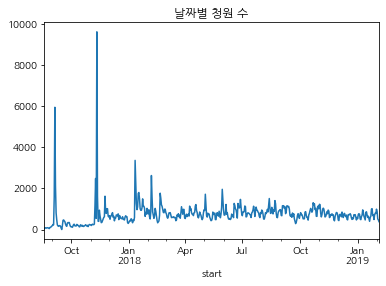


#### 2017-08-19부터 2019-02-04까지 날짜별 청원 수를 나타낸 시계열 그래프이다. 위 그래프에서 청원 수가 거의 10000에 가까운, 가장 큰 지점이 청원이 가장 많이 들어 온 날; 2017-11-11임을 알 수 있다.


```python
m = df.set_index('start')
m.loc['2017-11-11']
```


<div>
<style scoped>
    .dataframe tbody tr th:only-of-type {
        vertical-align: middle;
    }

    .dataframe tbody tr th {
        vertical-align: top;
    }

    .dataframe thead th {
        text-align: right;
    }
</style>
<table border="1" class="dataframe">
  <thead>
    <tr style="text-align: right;">
      <th></th>
      <th>article_id</th>
      <th>end</th>
      <th>answered</th>
      <th>votes</th>
      <th>category</th>
      <th>title</th>
      <th>content</th>
      <th>answer</th>
      <th>no_answer</th>
      <th>answer_diff</th>
    </tr>
    <tr>
      <th>start</th>
      <th></th>
      <th></th>
      <th></th>
      <th></th>
      <th></th>
      <th></th>
      <th></th>
      <th></th>
      <th></th>
      <th></th>
    </tr>
  </thead>
  <tbody>
    <tr>
      <th>2017-11-11</th>
      <td>31383</td>
      <td>2017-12-11</td>
      <td>0</td>
      <td>1</td>
      <td>정치개혁</td>
      <td>이명박 출국금지</td>
      <td>이명박 출국금지\n조속한 구속수사</td>
      <td>0</td>
      <td>1</td>
      <td>0</td>
    </tr>
    <tr>
      <th>2017-11-11</th>
      <td>31384</td>
      <td>2017-12-11</td>
      <td>0</td>
      <td>3</td>
      <td>인권/성평등</td>
      <td>조두순 출소 금지</td>
      <td>조두순의 출소금지 특별법 제정을 촉구 합니다.</td>
      <td>0</td>
      <td>1</td>
      <td>0</td>
    </tr>
    <tr>
      <th>2017-11-11</th>
      <td>31386</td>
      <td>2017-12-11</td>
      <td>0</td>
      <td>39</td>
      <td>정치개혁</td>
      <td>이명박 출국금지</td>
      <td>정의가 바로 선 나라를 만들기 위해 꼭...!</td>
      <td>0</td>
      <td>1</td>
      <td>0</td>
    </tr>
    <tr>
      <th>2017-11-11</th>
      <td>31387</td>
      <td>2017-12-11</td>
      <td>0</td>
      <td>2</td>
      <td>정치개혁</td>
      <td>이명박출국금지시켜라</td>
      <td>명박이을출국금지시키고  수사하라</td>
      <td>0</td>
      <td>1</td>
      <td>0</td>
    </tr>
    <tr>
      <th>2017-11-11</th>
      <td>31388</td>
      <td>2017-12-11</td>
      <td>0</td>
      <td>1</td>
      <td>정치개혁</td>
      <td>이명박출국금지시켜라</td>
      <td>명박이을출국금지시키고  수사하라</td>
      <td>0</td>
      <td>1</td>
      <td>0</td>
    </tr>
    <tr>
      <th>...</th>
      <td>...</td>
      <td>...</td>
      <td>...</td>
      <td>...</td>
      <td>...</td>
      <td>...</td>
      <td>...</td>
      <td>...</td>
      <td>...</td>
      <td>...</td>
    </tr>
    <tr>
      <th>2017-11-11</th>
      <td>41068</td>
      <td>2017-12-11</td>
      <td>0</td>
      <td>0</td>
      <td>정치개혁</td>
      <td>이명박 출금</td>
      <td>MB 출금</td>
      <td>0</td>
      <td>1</td>
      <td>0</td>
    </tr>
    <tr>
      <th>2017-11-11</th>
      <td>41069</td>
      <td>2017-12-11</td>
      <td>0</td>
      <td>2</td>
      <td>정치개혁</td>
      <td>이명박 전대통령 출국금지 청원</td>
      <td>수사대상이 될 인물이 출국하면 안 되겠지요.</td>
      <td>0</td>
      <td>1</td>
      <td>0</td>
    </tr>
    <tr>
      <th>2017-11-11</th>
      <td>41070</td>
      <td>2017-12-11</td>
      <td>0</td>
      <td>2</td>
      <td>기타</td>
      <td>이명박 출국금지</td>
      <td>죄갑을 치루고 출국</td>
      <td>0</td>
      <td>1</td>
      <td>0</td>
    </tr>
    <tr>
      <th>2017-11-11</th>
      <td>41072</td>
      <td>2017-12-11</td>
      <td>0</td>
      <td>0</td>
      <td>정치개혁</td>
      <td>이명박을 구속 수사 해주세요</td>
      <td>이명박을 출국 금지 시켜주세요\n정말 나라가 나라가 아니었던 것에 대한 큰 역할을 ...</td>
      <td>0</td>
      <td>1</td>
      <td>0</td>
    </tr>
    <tr>
      <th>2017-11-11</th>
      <td>41073</td>
      <td>2017-12-11</td>
      <td>0</td>
      <td>0</td>
      <td>정치개혁</td>
      <td>이명박 출국금지 그리고 구속수사를 요청</td>
      <td>이명박 출국금지 그리고 구속수사를 요청함.</td>
      <td>0</td>
      <td>1</td>
      <td>0</td>
    </tr>
  </tbody>
</table>
<p>9623 rows × 10 columns</p>
</div>


```python
mm = m.loc['2017-11-11']
mm.category.value_counts()
```


    정치개혁           7961
    기타              865
    미래              170
    인권/성평등          154
    안전/환경           128
    외교/통일/국방         61
    행정               59
    경제민주화            47
    육아/교육            46
    일자리              25
    반려동물             24
    보건복지             20
    문화/예술/체육/언론      19
    교통/건축/국토         16
    성장동력             15
    저출산/고령화대책         7
    농산어촌              6
    Name: category, dtype: int64


#### 2017-11-11 당시 <정치개혁> 분야에서 무려 7961건에 해당하는 청원이 제기되었으며, 청원 내용은 '이명박 전 대통령 출국 금지'에 대한 내용이 대부분임을 짐작할 수 있다.


### 6. '전체 청원' 중 투표는 어느 분야가 가장 많이 받았는가?


```python
petitions_unique = pd.pivot_table(df, index=['category'], aggfunc=np.sum)
petitions_best = petitions_unique.sort_values(by='votes', \
                                              ascending=False).reset_index()
petitions_best #투표를 가장 많이 받은 분야; 인권/성평등
```


<div>
<style scoped>
    .dataframe tbody tr th:only-of-type {
        vertical-align: middle;
    }

    .dataframe tbody tr th {
        vertical-align: top;
    }

    .dataframe thead th {
        text-align: right;
    }
</style>
<table border="1" class="dataframe">
  <thead>
    <tr style="text-align: right;">
      <th></th>
      <th>category</th>
      <th>answer</th>
      <th>answer_diff</th>
      <th>answered</th>
      <th>article_id</th>
      <th>no_answer</th>
      <th>votes</th>
    </tr>
  </thead>
  <tbody>
    <tr>
      <th>0</th>
      <td>인권/성평등</td>
      <td>24</td>
      <td>15</td>
      <td>9</td>
      <td>7963154504</td>
      <td>34969</td>
      <td>12559348</td>
    </tr>
    <tr>
      <th>1</th>
      <td>안전/환경</td>
      <td>10</td>
      <td>8</td>
      <td>2</td>
      <td>7529327085</td>
      <td>30628</td>
      <td>6605175</td>
    </tr>
    <tr>
      <th>2</th>
      <td>정치개혁</td>
      <td>8</td>
      <td>6</td>
      <td>2</td>
      <td>14675522264</td>
      <td>62742</td>
      <td>6205013</td>
    </tr>
    <tr>
      <th>3</th>
      <td>기타</td>
      <td>8</td>
      <td>7</td>
      <td>1</td>
      <td>12225143856</td>
      <td>48674</td>
      <td>5190468</td>
    </tr>
    <tr>
      <th>4</th>
      <td>육아/교육</td>
      <td>3</td>
      <td>2</td>
      <td>1</td>
      <td>5822857976</td>
      <td>25534</td>
      <td>4475297</td>
    </tr>
    <tr>
      <th>5</th>
      <td>보건복지</td>
      <td>3</td>
      <td>1</td>
      <td>2</td>
      <td>6589637853</td>
      <td>24845</td>
      <td>4341211</td>
    </tr>
    <tr>
      <th>6</th>
      <td>문화/예술/체육/언론</td>
      <td>7</td>
      <td>3</td>
      <td>4</td>
      <td>4427495546</td>
      <td>18200</td>
      <td>4149796</td>
    </tr>
    <tr>
      <th>7</th>
      <td>외교/통일/국방</td>
      <td>4</td>
      <td>3</td>
      <td>1</td>
      <td>6869752323</td>
      <td>26622</td>
      <td>3696112</td>
    </tr>
    <tr>
      <th>8</th>
      <td>교통/건축/국토</td>
      <td>3</td>
      <td>1</td>
      <td>2</td>
      <td>8551310963</td>
      <td>28181</td>
      <td>2902330</td>
    </tr>
    <tr>
      <th>9</th>
      <td>반려동물</td>
      <td>4</td>
      <td>4</td>
      <td>0</td>
      <td>1033826398</td>
      <td>4053</td>
      <td>2066624</td>
    </tr>
    <tr>
      <th>10</th>
      <td>행정</td>
      <td>1</td>
      <td>0</td>
      <td>1</td>
      <td>5124064571</td>
      <td>20267</td>
      <td>1957460</td>
    </tr>
    <tr>
      <th>11</th>
      <td>경제민주화</td>
      <td>2</td>
      <td>1</td>
      <td>1</td>
      <td>4529147196</td>
      <td>16791</td>
      <td>1739580</td>
    </tr>
    <tr>
      <th>12</th>
      <td>일자리</td>
      <td>0</td>
      <td>0</td>
      <td>0</td>
      <td>6505177516</td>
      <td>23225</td>
      <td>1180778</td>
    </tr>
    <tr>
      <th>13</th>
      <td>미래</td>
      <td>1</td>
      <td>0</td>
      <td>1</td>
      <td>4449417157</td>
      <td>17999</td>
      <td>1140693</td>
    </tr>
    <tr>
      <th>14</th>
      <td>성장동력</td>
      <td>2</td>
      <td>0</td>
      <td>2</td>
      <td>1795132547</td>
      <td>7251</td>
      <td>871837</td>
    </tr>
    <tr>
      <th>15</th>
      <td>저출산/고령화대책</td>
      <td>0</td>
      <td>0</td>
      <td>0</td>
      <td>913203527</td>
      <td>3584</td>
      <td>178455</td>
    </tr>
    <tr>
      <th>16</th>
      <td>농산어촌</td>
      <td>0</td>
      <td>0</td>
      <td>0</td>
      <td>518987986</td>
      <td>1902</td>
      <td>118871</td>
    </tr>
  </tbody>
</table>
</div>


```python
i = petitions_best[['category', 'votes']]
i
```


<div>
<style scoped>
    .dataframe tbody tr th:only-of-type {
        vertical-align: middle;
    }

    .dataframe tbody tr th {
        vertical-align: top;
    }

    .dataframe thead th {
        text-align: right;
    }
</style>
<table border="1" class="dataframe">
  <thead>
    <tr style="text-align: right;">
      <th></th>
      <th>category</th>
      <th>votes</th>
    </tr>
  </thead>
  <tbody>
    <tr>
      <th>0</th>
      <td>인권/성평등</td>
      <td>12559348</td>
    </tr>
    <tr>
      <th>1</th>
      <td>안전/환경</td>
      <td>6605175</td>
    </tr>
    <tr>
      <th>2</th>
      <td>정치개혁</td>
      <td>6205013</td>
    </tr>
    <tr>
      <th>3</th>
      <td>기타</td>
      <td>5190468</td>
    </tr>
    <tr>
      <th>4</th>
      <td>육아/교육</td>
      <td>4475297</td>
    </tr>
    <tr>
      <th>5</th>
      <td>보건복지</td>
      <td>4341211</td>
    </tr>
    <tr>
      <th>6</th>
      <td>문화/예술/체육/언론</td>
      <td>4149796</td>
    </tr>
    <tr>
      <th>7</th>
      <td>외교/통일/국방</td>
      <td>3696112</td>
    </tr>
    <tr>
      <th>8</th>
      <td>교통/건축/국토</td>
      <td>2902330</td>
    </tr>
    <tr>
      <th>9</th>
      <td>반려동물</td>
      <td>2066624</td>
    </tr>
    <tr>
      <th>10</th>
      <td>행정</td>
      <td>1957460</td>
    </tr>
    <tr>
      <th>11</th>
      <td>경제민주화</td>
      <td>1739580</td>
    </tr>
    <tr>
      <th>12</th>
      <td>일자리</td>
      <td>1180778</td>
    </tr>
    <tr>
      <th>13</th>
      <td>미래</td>
      <td>1140693</td>
    </tr>
    <tr>
      <th>14</th>
      <td>성장동력</td>
      <td>871837</td>
    </tr>
    <tr>
      <th>15</th>
      <td>저출산/고령화대책</td>
      <td>178455</td>
    </tr>
    <tr>
      <th>16</th>
      <td>농산어촌</td>
      <td>118871</td>
    </tr>
  </tbody>
</table>
</div>


```python
ax = plt.subplots(figsize=(15, 9)) 
ax = sns.barplot(x='category',y='votes', data=i)
ax.set_ylabel('total votes')
ax.set_title('투표를 가장 많이 받은 분야는?')
```


    Text(0.5, 1.0, '투표를 가장 많이 받은 분야는?')


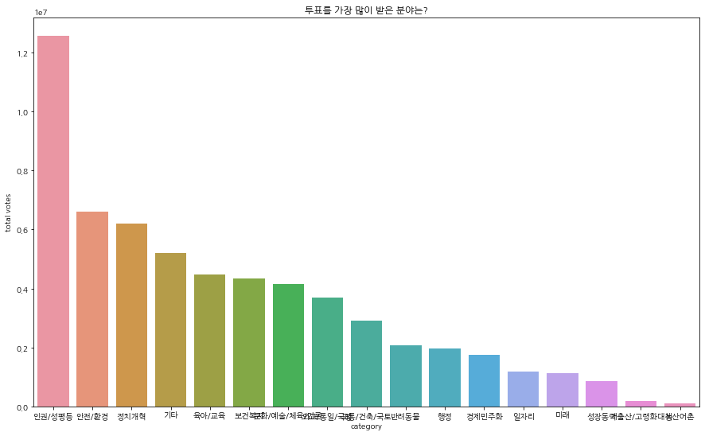


#### 1) '전체 청원' 중에서도 <인권/성평등> 분야의 투표 총합이 가장 높다. 이어서 답변 대상 청원 중 투표를 가장 많이 받은; 강서구 피시방 살인사건이 속한 <안전/환경> 분야도 '전체 청원' 중 두 번째로 투표 수가 많다.

#### 2) 가장 적은 청원을 받은 분야였던 <농산어촌> 분야에서, '전체 청원' 투표 총합도 가장 낮다.


### 7. 날짜별 투표 수 시계열 그래프


```python
petitions_start = pd.pivot_table(df, index=['start'], aggfunc=np.sum)
votes_df = petitions_start.sort_values(by='votes', ascending=False)
votes_df.loc[petitions_start['votes'] > 350000] #투표를 가장 많이 받은 날; 2018-10-17
```


<div>
<style scoped>
    .dataframe tbody tr th:only-of-type {
        vertical-align: middle;
    }

    .dataframe tbody tr th {
        vertical-align: top;
    }

    .dataframe thead th {
        text-align: right;
    }
</style>
<table border="1" class="dataframe">
  <thead>
    <tr style="text-align: right;">
      <th></th>
      <th>answer</th>
      <th>answer_diff</th>
      <th>answered</th>
      <th>article_id</th>
      <th>no_answer</th>
      <th>votes</th>
    </tr>
    <tr>
      <th>start</th>
      <th></th>
      <th></th>
      <th></th>
      <th></th>
      <th></th>
      <th></th>
    </tr>
  </thead>
  <tbody>
    <tr>
      <th>2018-10-17</th>
      <td>1</td>
      <td>1</td>
      <td>0</td>
      <td>378900198</td>
      <td>925</td>
      <td>1300523</td>
    </tr>
    <tr>
      <th>2018-10-31</th>
      <td>2</td>
      <td>2</td>
      <td>0</td>
      <td>430964099</td>
      <td>1008</td>
      <td>827096</td>
    </tr>
    <tr>
      <th>2018-06-13</th>
      <td>1</td>
      <td>1</td>
      <td>0</td>
      <td>146187973</td>
      <td>541</td>
      <td>786157</td>
    </tr>
    <tr>
      <th>2018-10-18</th>
      <td>2</td>
      <td>2</td>
      <td>0</td>
      <td>423557789</td>
      <td>1030</td>
      <td>721524</td>
    </tr>
    <tr>
      <th>2018-02-19</th>
      <td>1</td>
      <td>0</td>
      <td>1</td>
      <td>99332898</td>
      <td>697</td>
      <td>701520</td>
    </tr>
    <tr>
      <th>2018-11-09</th>
      <td>2</td>
      <td>2</td>
      <td>0</td>
      <td>349439392</td>
      <td>797</td>
      <td>672819</td>
    </tr>
    <tr>
      <th>2018-07-22</th>
      <td>1</td>
      <td>1</td>
      <td>0</td>
      <td>282639463</td>
      <td>897</td>
      <td>672491</td>
    </tr>
    <tr>
      <th>2017-09-06</th>
      <td>1</td>
      <td>0</td>
      <td>1</td>
      <td>22268570</td>
      <td>2120</td>
      <td>648209</td>
    </tr>
    <tr>
      <th>2018-06-24</th>
      <td>2</td>
      <td>2</td>
      <td>0</td>
      <td>359345089</td>
      <td>1270</td>
      <td>628925</td>
    </tr>
    <tr>
      <th>2018-10-04</th>
      <td>2</td>
      <td>1</td>
      <td>1</td>
      <td>290746555</td>
      <td>729</td>
      <td>626761</td>
    </tr>
    <tr>
      <th>2018-02-23</th>
      <td>2</td>
      <td>0</td>
      <td>2</td>
      <td>168561151</td>
      <td>1133</td>
      <td>608530</td>
    </tr>
    <tr>
      <th>2018-05-18</th>
      <td>1</td>
      <td>1</td>
      <td>0</td>
      <td>190599564</td>
      <td>805</td>
      <td>574483</td>
    </tr>
    <tr>
      <th>2018-05-11</th>
      <td>1</td>
      <td>0</td>
      <td>1</td>
      <td>119082098</td>
      <td>516</td>
      <td>556549</td>
    </tr>
    <tr>
      <th>2019-01-29</th>
      <td>2</td>
      <td>2</td>
      <td>0</td>
      <td>409753872</td>
      <td>800</td>
      <td>550474</td>
    </tr>
    <tr>
      <th>2018-05-25</th>
      <td>2</td>
      <td>2</td>
      <td>0</td>
      <td>217699031</td>
      <td>892</td>
      <td>514253</td>
    </tr>
    <tr>
      <th>2018-11-14</th>
      <td>1</td>
      <td>1</td>
      <td>0</td>
      <td>341163199</td>
      <td>771</td>
      <td>469027</td>
    </tr>
    <tr>
      <th>2018-06-17</th>
      <td>2</td>
      <td>2</td>
      <td>0</td>
      <td>158887091</td>
      <td>580</td>
      <td>468341</td>
    </tr>
    <tr>
      <th>2018-07-03</th>
      <td>1</td>
      <td>1</td>
      <td>0</td>
      <td>247788786</td>
      <td>841</td>
      <td>467132</td>
    </tr>
    <tr>
      <th>2018-04-17</th>
      <td>1</td>
      <td>0</td>
      <td>1</td>
      <td>232499699</td>
      <td>1144</td>
      <td>446950</td>
    </tr>
    <tr>
      <th>2018-05-02</th>
      <td>1</td>
      <td>1</td>
      <td>0</td>
      <td>204023320</td>
      <td>929</td>
      <td>445493</td>
    </tr>
    <tr>
      <th>2018-10-02</th>
      <td>1</td>
      <td>0</td>
      <td>1</td>
      <td>326518258</td>
      <td>824</td>
      <td>437841</td>
    </tr>
    <tr>
      <th>2017-09-03</th>
      <td>1</td>
      <td>0</td>
      <td>1</td>
      <td>404415</td>
      <td>229</td>
      <td>433356</td>
    </tr>
    <tr>
      <th>2018-06-14</th>
      <td>1</td>
      <td>0</td>
      <td>1</td>
      <td>204240095</td>
      <td>754</td>
      <td>403351</td>
    </tr>
    <tr>
      <th>2018-01-20</th>
      <td>1</td>
      <td>0</td>
      <td>1</td>
      <td>99071361</td>
      <td>939</td>
      <td>399683</td>
    </tr>
    <tr>
      <th>2017-11-17</th>
      <td>1</td>
      <td>0</td>
      <td>1</td>
      <td>23752225</td>
      <td>520</td>
      <td>393348</td>
    </tr>
    <tr>
      <th>2017-11-24</th>
      <td>1</td>
      <td>0</td>
      <td>1</td>
      <td>80814983</td>
      <td>1624</td>
      <td>392782</td>
    </tr>
    <tr>
      <th>2018-12-07</th>
      <td>1</td>
      <td>1</td>
      <td>0</td>
      <td>394821243</td>
      <td>852</td>
      <td>387305</td>
    </tr>
    <tr>
      <th>2018-03-24</th>
      <td>1</td>
      <td>1</td>
      <td>0</td>
      <td>96422371</td>
      <td>553</td>
      <td>385480</td>
    </tr>
    <tr>
      <th>2018-09-06</th>
      <td>1</td>
      <td>1</td>
      <td>0</td>
      <td>381171515</td>
      <td>1032</td>
      <td>383145</td>
    </tr>
    <tr>
      <th>2018-03-03</th>
      <td>1</td>
      <td>0</td>
      <td>1</td>
      <td>94454042</td>
      <td>601</td>
      <td>380016</td>
    </tr>
    <tr>
      <th>2018-01-15</th>
      <td>1</td>
      <td>0</td>
      <td>1</td>
      <td>106053634</td>
      <td>1105</td>
      <td>376187</td>
    </tr>
    <tr>
      <th>2018-04-16</th>
      <td>1</td>
      <td>1</td>
      <td>0</td>
      <td>168625159</td>
      <td>835</td>
      <td>369318</td>
    </tr>
    <tr>
      <th>2018-01-25</th>
      <td>1</td>
      <td>0</td>
      <td>1</td>
      <td>129153668</td>
      <td>1139</td>
      <td>364926</td>
    </tr>
    <tr>
      <th>2019-01-07</th>
      <td>1</td>
      <td>1</td>
      <td>0</td>
      <td>312286224</td>
      <td>637</td>
      <td>352139</td>
    </tr>
  </tbody>
</table>
</div>


```python
time2 = votes_df.sort_values('start')
time3 = time2[['votes']]
time3
```


<div>
<style scoped>
    .dataframe tbody tr th:only-of-type {
        vertical-align: middle;
    }

    .dataframe tbody tr th {
        vertical-align: top;
    }

    .dataframe thead th {
        text-align: right;
    }
</style>
<table border="1" class="dataframe">
  <thead>
    <tr style="text-align: right;">
      <th></th>
      <th>votes</th>
    </tr>
    <tr>
      <th>start</th>
      <th></th>
    </tr>
  </thead>
  <tbody>
    <tr>
      <th>2017-08-19</th>
      <td>20703</td>
    </tr>
    <tr>
      <th>2017-08-20</th>
      <td>31710</td>
    </tr>
    <tr>
      <th>2017-08-21</th>
      <td>1884</td>
    </tr>
    <tr>
      <th>2017-08-22</th>
      <td>2607</td>
    </tr>
    <tr>
      <th>2017-08-23</th>
      <td>13446</td>
    </tr>
    <tr>
      <th>...</th>
      <td>...</td>
    </tr>
    <tr>
      <th>2019-01-31</th>
      <td>52267</td>
    </tr>
    <tr>
      <th>2019-02-01</th>
      <td>44175</td>
    </tr>
    <tr>
      <th>2019-02-02</th>
      <td>23983</td>
    </tr>
    <tr>
      <th>2019-02-03</th>
      <td>41556</td>
    </tr>
    <tr>
      <th>2019-02-04</th>
      <td>14234</td>
    </tr>
  </tbody>
</table>
<p>535 rows × 1 columns</p>
</div>


```python
time3['votes'].plot(title = '날짜별 투표 수')
```


    <AxesSubplot:title={'center':'날짜별 투표 수'}, xlabel='start'>


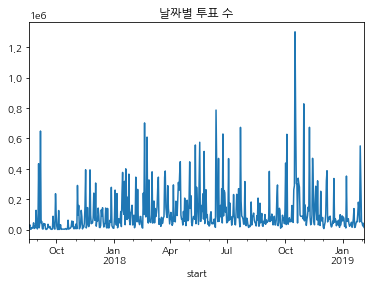


#### 2017-08-19부터 2019-02-04까지 날짜별 청원 수를 나타낸 시계열 그래프이다. 위 그래프에서 투표 수가 가장 높은 지점이 바로 2018-10-17임을 알 수 있다.


```python
n = df.set_index('start')
n.loc['2018-10-17']
```


<div>
<style scoped>
    .dataframe tbody tr th:only-of-type {
        vertical-align: middle;
    }

    .dataframe tbody tr th {
        vertical-align: top;
    }

    .dataframe thead th {
        text-align: right;
    }
</style>
<table border="1" class="dataframe">
  <thead>
    <tr style="text-align: right;">
      <th></th>
      <th>article_id</th>
      <th>end</th>
      <th>answered</th>
      <th>votes</th>
      <th>category</th>
      <th>title</th>
      <th>content</th>
      <th>answer</th>
      <th>no_answer</th>
      <th>answer_diff</th>
    </tr>
    <tr>
      <th>start</th>
      <th></th>
      <th></th>
      <th></th>
      <th></th>
      <th></th>
      <th></th>
      <th></th>
      <th></th>
      <th></th>
      <th></th>
    </tr>
  </thead>
  <tbody>
    <tr>
      <th>2018-10-17</th>
      <td>408596</td>
      <td>2018-11-16</td>
      <td>0</td>
      <td>52</td>
      <td>일자리</td>
      <td>공무원 비정규직의 정규직 전환 방침, 전면 재검토해주세요.</td>
      <td>지금 진행되고 있는 공공분야(공무원, 공사, 공공기관,...)에서의 계약직 직원을 ...</td>
      <td>0</td>
      <td>1</td>
      <td>0</td>
    </tr>
    <tr>
      <th>2018-10-17</th>
      <td>408597</td>
      <td>2018-11-16</td>
      <td>0</td>
      <td>238</td>
      <td>인권/성평등</td>
      <td>아동권리와 교사 권리를 동등하게 해주세요</td>
      <td>현재 김포 어린이집 교사 자살사건과 관련해 청원글을 올립니다.\n만약 지금 죽음의 ...</td>
      <td>0</td>
      <td>1</td>
      <td>0</td>
    </tr>
    <tr>
      <th>2018-10-17</th>
      <td>408598</td>
      <td>2018-11-16</td>
      <td>0</td>
      <td>14</td>
      <td>육아/교육</td>
      <td>특수학교 및 일반학교 특수학급 cctv 설치 의무화</td>
      <td>특수학교 및 일반학교 특수학급 cctv 설치 의무화해야합니다. 이번 폭행사건 뿐만 ...</td>
      <td>0</td>
      <td>1</td>
      <td>0</td>
    </tr>
    <tr>
      <th>2018-10-17</th>
      <td>408599</td>
      <td>2018-11-16</td>
      <td>0</td>
      <td>6</td>
      <td>육아/교육</td>
      <td>원주 oo 어린이집  3살혀 다짤릴뻔 보험사언과연계 10년이 다돼서 보상받음</td>
      <td>아들둘 키우고 있습니다.10년이 넘은 예기를 하고자합니다.어려운 가정 형편에 국공립...</td>
      <td>0</td>
      <td>1</td>
      <td>0</td>
    </tr>
    <tr>
      <th>2018-10-17</th>
      <td>408601</td>
      <td>2018-11-16</td>
      <td>0</td>
      <td>49</td>
      <td>교통/건축/국토</td>
      <td>주택소유이력이 있는 신혼부부만 특별 공급 제외는 부당합니다.</td>
      <td>저는 부산에서 두자녀를 키우며 외벌이를 하고 있는 소득기준 100% 이내의 흙수저 ...</td>
      <td>0</td>
      <td>1</td>
      <td>0</td>
    </tr>
    <tr>
      <th>...</th>
      <td>...</td>
      <td>...</td>
      <td>...</td>
      <td>...</td>
      <td>...</td>
      <td>...</td>
      <td>...</td>
      <td>...</td>
      <td>...</td>
      <td>...</td>
    </tr>
    <tr>
      <th>2018-10-17</th>
      <td>409778</td>
      <td>2018-11-16</td>
      <td>0</td>
      <td>1</td>
      <td>기타</td>
      <td>삼청교육대학 설립추진</td>
      <td>삼청교육대학 개강중에는 그많던 깡패들이 없어졌어요.재판시 사회봉사 명령보다는 삼청교...</td>
      <td>0</td>
      <td>1</td>
      <td>0</td>
    </tr>
    <tr>
      <th>2018-10-17</th>
      <td>409779</td>
      <td>2018-11-16</td>
      <td>0</td>
      <td>2</td>
      <td>정치개혁</td>
      <td>김지수 음주운전에 관련한 법을 만들어 주세요.</td>
      <td>배우 김지수가 얼마나 유명한지 모르겠지만...\n음주사고로 고통 주는 가해자와 음주...</td>
      <td>0</td>
      <td>1</td>
      <td>0</td>
    </tr>
    <tr>
      <th>2018-10-17</th>
      <td>409781</td>
      <td>2018-11-16</td>
      <td>0</td>
      <td>37</td>
      <td>정치개혁</td>
      <td>꼭들어주세요 부탁드립니다</td>
      <td>지금이라도 늦지않았습니다\n제발 난민 취소해주세요\n안전한 나라에서 살고싶습니다</td>
      <td>0</td>
      <td>1</td>
      <td>0</td>
    </tr>
    <tr>
      <th>2018-10-17</th>
      <td>409782</td>
      <td>2018-11-16</td>
      <td>0</td>
      <td>10</td>
      <td>문화/예술/체육/언론</td>
      <td>온라인 암표상도 오프라인 암표상 같이 처벌 원합니다!</td>
      <td>언제부터 온라인으로 표사서\n실 구매자에게 비싸게 파는 행위가\n재테크가 된건가요?...</td>
      <td>0</td>
      <td>1</td>
      <td>0</td>
    </tr>
    <tr>
      <th>2018-10-17</th>
      <td>409784</td>
      <td>2018-11-16</td>
      <td>0</td>
      <td>47</td>
      <td>저출산/고령화대책</td>
      <td>대한민국에서의 동성애를 법적으로 금지해주세요</td>
      <td>현재 저출산 고령화사화인데, 동성애를 합법으로 받아들이고, 퀴어축제 같은 축제들을 ...</td>
      <td>0</td>
      <td>1</td>
      <td>0</td>
    </tr>
  </tbody>
</table>
<p>926 rows × 10 columns</p>
</div>


```python
nn = n.loc['2018-10-17']
nn.sort_values('votes', ascending=False).head()
```


<div>
<style scoped>
    .dataframe tbody tr th:only-of-type {
        vertical-align: middle;
    }

    .dataframe tbody tr th {
        vertical-align: top;
    }

    .dataframe thead th {
        text-align: right;
    }
</style>
<table border="1" class="dataframe">
  <thead>
    <tr style="text-align: right;">
      <th></th>
      <th>article_id</th>
      <th>end</th>
      <th>answered</th>
      <th>votes</th>
      <th>category</th>
      <th>title</th>
      <th>content</th>
      <th>answer</th>
      <th>no_answer</th>
      <th>answer_diff</th>
    </tr>
    <tr>
      <th>start</th>
      <th></th>
      <th></th>
      <th></th>
      <th></th>
      <th></th>
      <th></th>
      <th></th>
      <th></th>
      <th></th>
      <th></th>
    </tr>
  </thead>
  <tbody>
    <tr>
      <th>2018-10-17</th>
      <td>408609</td>
      <td>2018-11-16</td>
      <td>0</td>
      <td>1192049</td>
      <td>안전/환경</td>
      <td>강서구 피시방 살인 사건. 또 심신미약 피의자입니다.</td>
      <td>2018년 10월 14일 엊그제 일어난 강서구 피시방 살인사건에 대한 청원입니다.\...</td>
      <td>1</td>
      <td>0</td>
      <td>1</td>
    </tr>
    <tr>
      <th>2018-10-17</th>
      <td>408989</td>
      <td>2018-11-16</td>
      <td>0</td>
      <td>53615</td>
      <td>인권/성평등</td>
      <td>유흥탐정. 데이터베이스 성매매남성 조사합시다.</td>
      <td>성매매는 불법입니다.\n이번에 유흥탐정 운영자 구속되었다고 하던데\n업주들만 쓴다는...</td>
      <td>0</td>
      <td>1</td>
      <td>0</td>
    </tr>
    <tr>
      <th>2018-10-17</th>
      <td>409477</td>
      <td>2018-11-16</td>
      <td>0</td>
      <td>5831</td>
      <td>육아/교육</td>
      <td>영양교사 제도를 폐지하고 본래의 식품위생직 공무원 선발로 환원해 주시기 바랍니다.</td>
      <td>청원에 앞서 학교에서 따뜻하게 밥 한 끼를 만들어주시는 급식종사자 여러분들 그리고 ...</td>
      <td>0</td>
      <td>1</td>
      <td>0</td>
    </tr>
    <tr>
      <th>2018-10-17</th>
      <td>408759</td>
      <td>2018-11-16</td>
      <td>0</td>
      <td>4611</td>
      <td>외교/통일/국방</td>
      <td>[긴급]피지에 있는 400여명을 살려 주세요</td>
      <td>제발 도와주십시오.\n피지에서 현대판 노예생활을 하고 있는 400여명을 제발 구해주...</td>
      <td>0</td>
      <td>1</td>
      <td>0</td>
    </tr>
    <tr>
      <th>2018-10-17</th>
      <td>408885</td>
      <td>2018-11-16</td>
      <td>0</td>
      <td>3484</td>
      <td>외교/통일/국방</td>
      <td>*(긴급)제주 예맨 난민 339명 인도적체류 허가, 이게 정부냐</td>
      <td>결국엔   모두 인도체류로  출도해제로  전국 어디로 갈수 있게  만들었다\n정부는...</td>
      <td>0</td>
      <td>1</td>
      <td>0</td>
    </tr>
  </tbody>
</table>
</div>


#### 2018-10-17 당시 <안전/환경> 분야에서 무려 1192049건의 투표를 받았으며, 이는 역대 가장 많은 투표를 받았던 '강서구 피시방 살인 사건'에 대한 청원이다.


### 8. 청원을 많이 받은 날 VS 투표를 많이 받은 날


```python
votes_df = votes_df.reset_index()
hottest_day_df = start_df.merge(votes_df, on='start', how='left')
hottest_day_df.sort_values('counts', ascending=False)[:5] #청원을 많이 받은 날 상위 5개 목록
```


<div>
<style scoped>
    .dataframe tbody tr th:only-of-type {
        vertical-align: middle;
    }

    .dataframe tbody tr th {
        vertical-align: top;
    }

    .dataframe thead th {
        text-align: right;
    }
</style>
<table border="1" class="dataframe">
  <thead>
    <tr style="text-align: right;">
      <th></th>
      <th>start</th>
      <th>counts</th>
      <th>answer</th>
      <th>answer_diff</th>
      <th>answered</th>
      <th>article_id</th>
      <th>no_answer</th>
      <th>votes</th>
    </tr>
  </thead>
  <tbody>
    <tr>
      <th>0</th>
      <td>2017-11-11</td>
      <td>9623</td>
      <td>0</td>
      <td>0</td>
      <td>0</td>
      <td>348559310</td>
      <td>9623</td>
      <td>85074</td>
    </tr>
    <tr>
      <th>1</th>
      <td>2017-09-05</td>
      <td>5952</td>
      <td>0</td>
      <td>0</td>
      <td>0</td>
      <td>38414241</td>
      <td>5952</td>
      <td>48808</td>
    </tr>
    <tr>
      <th>2</th>
      <td>2018-01-11</td>
      <td>3368</td>
      <td>0</td>
      <td>0</td>
      <td>0</td>
      <td>291069195</td>
      <td>3368</td>
      <td>44570</td>
    </tr>
    <tr>
      <th>3</th>
      <td>2018-02-06</td>
      <td>2631</td>
      <td>0</td>
      <td>0</td>
      <td>0</td>
      <td>342371897</td>
      <td>2631</td>
      <td>83038</td>
    </tr>
    <tr>
      <th>4</th>
      <td>2017-11-09</td>
      <td>2487</td>
      <td>0</td>
      <td>0</td>
      <td>0</td>
      <td>73459579</td>
      <td>2487</td>
      <td>34774</td>
    </tr>
  </tbody>
</table>
</div>


```python
hottest_day_df.sort_values('votes', ascending=False)[:5] #투표를 많이 받은 날 상위 5개 목록
```


<div>
<style scoped>
    .dataframe tbody tr th:only-of-type {
        vertical-align: middle;
    }

    .dataframe tbody tr th {
        vertical-align: top;
    }

    .dataframe thead th {
        text-align: right;
    }
</style>
<table border="1" class="dataframe">
  <thead>
    <tr style="text-align: right;">
      <th></th>
      <th>start</th>
      <th>counts</th>
      <th>answer</th>
      <th>answer_diff</th>
      <th>answered</th>
      <th>article_id</th>
      <th>no_answer</th>
      <th>votes</th>
    </tr>
  </thead>
  <tbody>
    <tr>
      <th>116</th>
      <td>2018-10-17</td>
      <td>926</td>
      <td>1</td>
      <td>1</td>
      <td>0</td>
      <td>378900198</td>
      <td>925</td>
      <td>1300523</td>
    </tr>
    <tr>
      <th>81</th>
      <td>2018-10-31</td>
      <td>1010</td>
      <td>2</td>
      <td>2</td>
      <td>0</td>
      <td>430964099</td>
      <td>1008</td>
      <td>827096</td>
    </tr>
    <tr>
      <th>384</th>
      <td>2018-06-13</td>
      <td>542</td>
      <td>1</td>
      <td>1</td>
      <td>0</td>
      <td>146187973</td>
      <td>541</td>
      <td>786157</td>
    </tr>
    <tr>
      <th>72</th>
      <td>2018-10-18</td>
      <td>1032</td>
      <td>2</td>
      <td>2</td>
      <td>0</td>
      <td>423557789</td>
      <td>1030</td>
      <td>721524</td>
    </tr>
    <tr>
      <th>270</th>
      <td>2018-02-19</td>
      <td>698</td>
      <td>1</td>
      <td>0</td>
      <td>1</td>
      <td>99332898</td>
      <td>697</td>
      <td>701520</td>
    </tr>
  </tbody>
</table>
</div>


### 9. 청원이 가장 많이 들어온 달 / 일 / 요일 ?


```python
import datetime
df['start_month'] = df['start'].dt.month
df['start_day'] = df['start'].dt.day
df['start_hour'] = df['start'].dt.hour
df['start_dow'] = df['start'].dt.dayofweek
```


```python
df
```


<div>
<style scoped>
    .dataframe tbody tr th:only-of-type {
        vertical-align: middle;
    }

    .dataframe tbody tr th {
        vertical-align: top;
    }

    .dataframe thead th {
        text-align: right;
    }
</style>
<table border="1" class="dataframe">
  <thead>
    <tr style="text-align: right;">
      <th></th>
      <th>article_id</th>
      <th>start</th>
      <th>end</th>
      <th>answered</th>
      <th>votes</th>
      <th>category</th>
      <th>title</th>
      <th>content</th>
      <th>answer</th>
      <th>no_answer</th>
      <th>answer_diff</th>
      <th>start_month</th>
      <th>start_day</th>
      <th>start_hour</th>
      <th>start_dow</th>
    </tr>
  </thead>
  <tbody>
    <tr>
      <th>0</th>
      <td>21</td>
      <td>2017-08-19</td>
      <td>2017-11-17</td>
      <td>0</td>
      <td>9</td>
      <td>안전/환경</td>
      <td>스텔라 데이지호에 대한 제안입니다.</td>
      <td>스텔라 데이지호에 대한 제안입니다.\n3월31일 스텔라 데이지호가 침몰하고 5달째가...</td>
      <td>0</td>
      <td>1</td>
      <td>0</td>
      <td>8</td>
      <td>19</td>
      <td>0</td>
      <td>5</td>
    </tr>
    <tr>
      <th>1</th>
      <td>22</td>
      <td>2017-08-19</td>
      <td>2017-11-17</td>
      <td>0</td>
      <td>17</td>
      <td>기타</td>
      <td>비리제보처를 만들어주세요.</td>
      <td>현 정부에 국민들이 가장 원하는 것은 부패척결입니다.  우리 사회에 각종 비리들이 ...</td>
      <td>0</td>
      <td>1</td>
      <td>0</td>
      <td>8</td>
      <td>19</td>
      <td>0</td>
      <td>5</td>
    </tr>
    <tr>
      <th>2</th>
      <td>23</td>
      <td>2017-08-19</td>
      <td>2017-09-03</td>
      <td>0</td>
      <td>0</td>
      <td>미래</td>
      <td>제2의 개성공단</td>
      <td>만일 하시는 대통령님 및 각 부처 장관님,주무관님들 안녕하세요!!\n전남 목포에서 ...</td>
      <td>0</td>
      <td>1</td>
      <td>0</td>
      <td>8</td>
      <td>19</td>
      <td>0</td>
      <td>5</td>
    </tr>
    <tr>
      <th>3</th>
      <td>24</td>
      <td>2017-08-19</td>
      <td>2017-08-26</td>
      <td>0</td>
      <td>53</td>
      <td>일자리</td>
      <td>공공기관 무조건적인 정규직전환을 반대합니다.</td>
      <td>현정부에서 정규직 일자리를 늘리는 것에 찬성합니다. 그런데 공공기관 비정규직들은 인...</td>
      <td>0</td>
      <td>1</td>
      <td>0</td>
      <td>8</td>
      <td>19</td>
      <td>0</td>
      <td>5</td>
    </tr>
    <tr>
      <th>4</th>
      <td>25</td>
      <td>2017-08-19</td>
      <td>2017-09-03</td>
      <td>0</td>
      <td>0</td>
      <td>미래</td>
      <td>제2의 개성공단</td>
      <td>만일 하시는 대통령님 및 각 부처 장관님,주무관님들 안녕하세요!!\n전남 목포에서 ...</td>
      <td>0</td>
      <td>1</td>
      <td>0</td>
      <td>8</td>
      <td>19</td>
      <td>0</td>
      <td>5</td>
    </tr>
    <tr>
      <th>...</th>
      <td>...</td>
      <td>...</td>
      <td>...</td>
      <td>...</td>
      <td>...</td>
      <td>...</td>
      <td>...</td>
      <td>...</td>
      <td>...</td>
      <td>...</td>
      <td>...</td>
      <td>...</td>
      <td>...</td>
      <td>...</td>
      <td>...</td>
    </tr>
    <tr>
      <th>395542</th>
      <td>517117</td>
      <td>2019-02-04</td>
      <td>2019-03-06</td>
      <td>0</td>
      <td>3</td>
      <td>보건복지</td>
      <td>명절연휴 고속도로 무료반대</td>
      <td>명절고속도로 무료보단 대다수의 서민들이 이용하는 대중교통 무료와 명절기간 증차로 했...</td>
      <td>0</td>
      <td>1</td>
      <td>0</td>
      <td>2</td>
      <td>4</td>
      <td>0</td>
      <td>0</td>
    </tr>
    <tr>
      <th>395543</th>
      <td>517119</td>
      <td>2019-02-04</td>
      <td>2019-03-06</td>
      <td>0</td>
      <td>23</td>
      <td>보건복지</td>
      <td>광주사태 가짜 유공자들 정수기로 걸려내야함</td>
      <td>광주사태 유공자들 차고 넘치는데 이래 많은 유공자들 그냥놓아두면 재앙이다.\n김대중...</td>
      <td>0</td>
      <td>1</td>
      <td>0</td>
      <td>2</td>
      <td>4</td>
      <td>0</td>
      <td>0</td>
    </tr>
    <tr>
      <th>395544</th>
      <td>517120</td>
      <td>2019-02-04</td>
      <td>2019-03-06</td>
      <td>0</td>
      <td>0</td>
      <td>안전/환경</td>
      <td>환경문제</td>
      <td>명절이면 후로 제일문제는 쓰레기 문제 입니다.\n제일문제는 선물세트와 농산물세트 입...</td>
      <td>0</td>
      <td>1</td>
      <td>0</td>
      <td>2</td>
      <td>4</td>
      <td>0</td>
      <td>0</td>
    </tr>
    <tr>
      <th>395545</th>
      <td>517121</td>
      <td>2019-02-04</td>
      <td>2019-03-06</td>
      <td>0</td>
      <td>20</td>
      <td>정치개혁</td>
      <td>청화대,더불어민주당, 당장 답하라,,,,,,</td>
      <td>좌파 더불어민주당, 좌파 정권 청화대는 선한 국민들을 더는 기망하지 말고 담장 답하...</td>
      <td>0</td>
      <td>1</td>
      <td>0</td>
      <td>2</td>
      <td>4</td>
      <td>0</td>
      <td>0</td>
    </tr>
    <tr>
      <th>395546</th>
      <td>517122</td>
      <td>2019-02-04</td>
      <td>2019-03-06</td>
      <td>0</td>
      <td>16</td>
      <td>인권/성평등</td>
      <td>여성부 폐지</td>
      <td>국민들이 원합니다\n폐지 좀 시키세요;</td>
      <td>0</td>
      <td>1</td>
      <td>0</td>
      <td>2</td>
      <td>4</td>
      <td>0</td>
      <td>0</td>
    </tr>
  </tbody>
</table>
<p>395547 rows × 15 columns</p>
</div>


```python
month_df = pd.DataFrame(df['start_month'].value_counts()).reset_index()
month_df.columns = ['start_month', 'counts']
month_df = month_df.sort_values('start_month', ascending=True)
month_df
```


<div>
<style scoped>
    .dataframe tbody tr th:only-of-type {
        vertical-align: middle;
    }

    .dataframe tbody tr th {
        vertical-align: top;
    }

    .dataframe thead th {
        text-align: right;
    }
</style>
<table border="1" class="dataframe">
  <thead>
    <tr style="text-align: right;">
      <th></th>
      <th>start_month</th>
      <th>counts</th>
    </tr>
  </thead>
  <tbody>
    <tr>
      <th>0</th>
      <td>1</td>
      <td>52941</td>
    </tr>
    <tr>
      <th>6</th>
      <td>2</td>
      <td>28117</td>
    </tr>
    <tr>
      <th>11</th>
      <td>3</td>
      <td>21795</td>
    </tr>
    <tr>
      <th>10</th>
      <td>4</td>
      <td>23227</td>
    </tr>
    <tr>
      <th>8</th>
      <td>5</td>
      <td>25499</td>
    </tr>
    <tr>
      <th>9</th>
      <td>6</td>
      <td>25483</td>
    </tr>
    <tr>
      <th>7</th>
      <td>7</td>
      <td>25714</td>
    </tr>
    <tr>
      <th>5</th>
      <td>8</td>
      <td>28851</td>
    </tr>
    <tr>
      <th>2</th>
      <td>9</td>
      <td>40888</td>
    </tr>
    <tr>
      <th>4</th>
      <td>10</td>
      <td>31687</td>
    </tr>
    <tr>
      <th>1</th>
      <td>11</td>
      <td>52847</td>
    </tr>
    <tr>
      <th>3</th>
      <td>12</td>
      <td>38498</td>
    </tr>
  </tbody>
</table>
</div>


```python
ax = plt.subplots(figsize=(15, 9)) 
ax = sns.barplot(x='start_month',y='counts', data=month_df)
ax.set_ylabel('total petitions')
ax.set_title('청원이 가장 많이 들어온 달은?')
```


    Text(0.5, 1.0, '청원이 가장 많이 들어온 달은?')


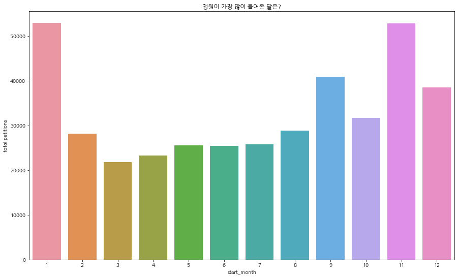


#### 1) 청원이 가장 많이 들어온 달은 1월이다. 몇 십개 차이로 11월은 청원이 두 번째로 많이 들어온 달이다.
#### 2) 반면 청원이 가장 적게 들어온 달은 3월이다.


```python
day_df = pd.DataFrame(df['start_day'].value_counts()).reset_index()
day_df.columns = ['start_day', 'counts']
day_df = day_df.sort_values('start_day', ascending=True)
day_df
```


<div>
<style scoped>
    .dataframe tbody tr th:only-of-type {
        vertical-align: middle;
    }

    .dataframe tbody tr th {
        vertical-align: top;
    }

    .dataframe thead th {
        text-align: right;
    }
</style>
<table border="1" class="dataframe">
  <thead>
    <tr style="text-align: right;">
      <th></th>
      <th>start_day</th>
      <th>counts</th>
    </tr>
  </thead>
  <tbody>
    <tr>
      <th>24</th>
      <td>1</td>
      <td>11766</td>
    </tr>
    <tr>
      <th>25</th>
      <td>2</td>
      <td>11730</td>
    </tr>
    <tr>
      <th>18</th>
      <td>3</td>
      <td>12270</td>
    </tr>
    <tr>
      <th>9</th>
      <td>4</td>
      <td>12717</td>
    </tr>
    <tr>
      <th>1</th>
      <td>5</td>
      <td>17307</td>
    </tr>
    <tr>
      <th>2</th>
      <td>6</td>
      <td>14766</td>
    </tr>
    <tr>
      <th>15</th>
      <td>7</td>
      <td>12489</td>
    </tr>
    <tr>
      <th>16</th>
      <td>8</td>
      <td>12297</td>
    </tr>
    <tr>
      <th>5</th>
      <td>9</td>
      <td>13107</td>
    </tr>
    <tr>
      <th>28</th>
      <td>10</td>
      <td>11412</td>
    </tr>
    <tr>
      <th>0</th>
      <td>11</td>
      <td>22689</td>
    </tr>
    <tr>
      <th>3</th>
      <td>12</td>
      <td>13983</td>
    </tr>
    <tr>
      <th>22</th>
      <td>13</td>
      <td>11938</td>
    </tr>
    <tr>
      <th>29</th>
      <td>14</td>
      <td>11071</td>
    </tr>
    <tr>
      <th>26</th>
      <td>15</td>
      <td>11524</td>
    </tr>
    <tr>
      <th>27</th>
      <td>16</td>
      <td>11473</td>
    </tr>
    <tr>
      <th>19</th>
      <td>17</td>
      <td>12185</td>
    </tr>
    <tr>
      <th>10</th>
      <td>18</td>
      <td>12679</td>
    </tr>
    <tr>
      <th>17</th>
      <td>19</td>
      <td>12278</td>
    </tr>
    <tr>
      <th>11</th>
      <td>20</td>
      <td>12638</td>
    </tr>
    <tr>
      <th>12</th>
      <td>21</td>
      <td>12530</td>
    </tr>
    <tr>
      <th>7</th>
      <td>22</td>
      <td>12868</td>
    </tr>
    <tr>
      <th>6</th>
      <td>23</td>
      <td>13039</td>
    </tr>
    <tr>
      <th>4</th>
      <td>24</td>
      <td>13461</td>
    </tr>
    <tr>
      <th>20</th>
      <td>25</td>
      <td>11972</td>
    </tr>
    <tr>
      <th>14</th>
      <td>26</td>
      <td>12507</td>
    </tr>
    <tr>
      <th>21</th>
      <td>27</td>
      <td>11947</td>
    </tr>
    <tr>
      <th>8</th>
      <td>28</td>
      <td>12745</td>
    </tr>
    <tr>
      <th>23</th>
      <td>29</td>
      <td>11799</td>
    </tr>
    <tr>
      <th>13</th>
      <td>30</td>
      <td>12524</td>
    </tr>
    <tr>
      <th>30</th>
      <td>31</td>
      <td>7836</td>
    </tr>
  </tbody>
</table>
</div>


```python
ax = plt.subplots(figsize=(15, 9)) 
ax = sns.barplot(x='start_day',y='counts', data=day_df)
ax.set_ylabel('total petitions')
ax.set_title('청원이 가장 많이 들어온 일은?')
```


    Text(0.5, 1.0, '청원이 가장 많이 들어온 일은?')


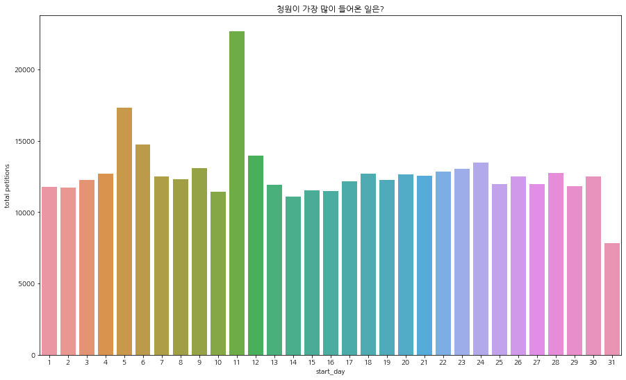


#### 1) 청원이 가장 많이 들어온 일은 11일이 독보적으로 많다.
#### 2) 반면 청원이 가장 적게 들어온 일은 31일이다. 아무래도 31일은 1월, 3월, 5월, 7월, 8월, 10월, 12월에만 있으므로 이러한 결과가 나온 것이라고 유추할 수 있다.


```python
dow_df = pd.DataFrame(df['start_dow'].value_counts()).reset_index()
dow_df.columns = ['start_dow', 'counts']
dow_df = dow_df.sort_values('start_dow', ascending=True)
dow_df #일(0), 월(1), 화(2), 수(3), 목(4), 금(5), 토(6)
```


<div>
<style scoped>
    .dataframe tbody tr th:only-of-type {
        vertical-align: middle;
    }

    .dataframe tbody tr th {
        vertical-align: top;
    }

    .dataframe thead th {
        text-align: right;
    }
</style>
<table border="1" class="dataframe">
  <thead>
    <tr style="text-align: right;">
      <th></th>
      <th>start_dow</th>
      <th>counts</th>
    </tr>
  </thead>
  <tbody>
    <tr>
      <th>4</th>
      <td>0</td>
      <td>54234</td>
    </tr>
    <tr>
      <th>0</th>
      <td>1</td>
      <td>65229</td>
    </tr>
    <tr>
      <th>2</th>
      <td>2</td>
      <td>61966</td>
    </tr>
    <tr>
      <th>1</th>
      <td>3</td>
      <td>63072</td>
    </tr>
    <tr>
      <th>3</th>
      <td>4</td>
      <td>56646</td>
    </tr>
    <tr>
      <th>5</th>
      <td>5</td>
      <td>50984</td>
    </tr>
    <tr>
      <th>6</th>
      <td>6</td>
      <td>43416</td>
    </tr>
  </tbody>
</table>
</div>


```python
ax = plt.subplots(figsize=(15, 9)) 
ax = sns.barplot(x='start_dow',y='counts', data=dow_df)
ax.set_ylabel('total petitions')
ax.set_title('청원이 가장 많이 들어온 요일은?')
```


    Text(0.5, 1.0, '청원이 가장 많이 들어온 요일은?')


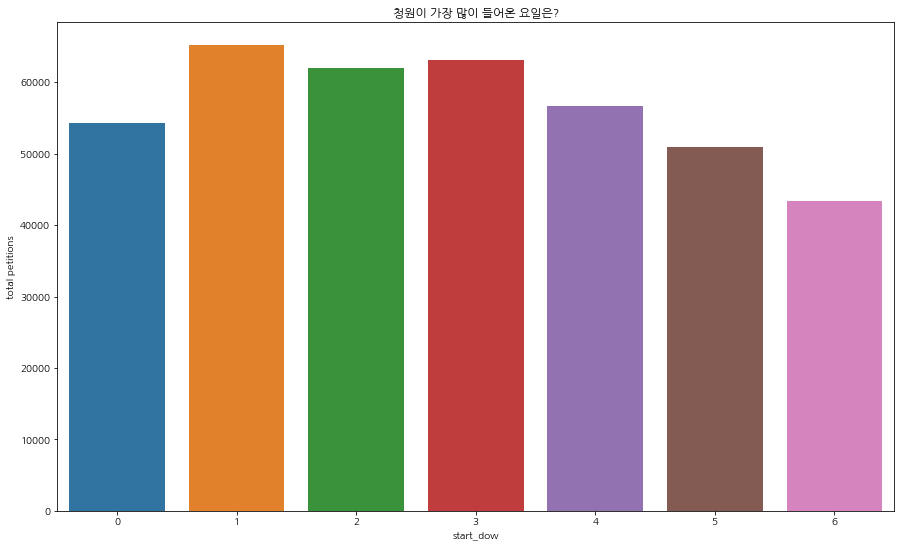


#### 1) 청원이 가장 많이 들어온 요일은 월요일이다. 주말이 지나고 월요일에 본격적으로 한 주가 시작되어 새로운 뉴스와 기사가 보도되곤 하므로, 이를 짐작해볼 수 있다.
#### 2) 반면 청원이 가장 적게 들어온 일은 토요일이다. 월요일에서부터 토요일까지 청원 수가 점진적으로 감소하는 추세를 볼 수 있다.


